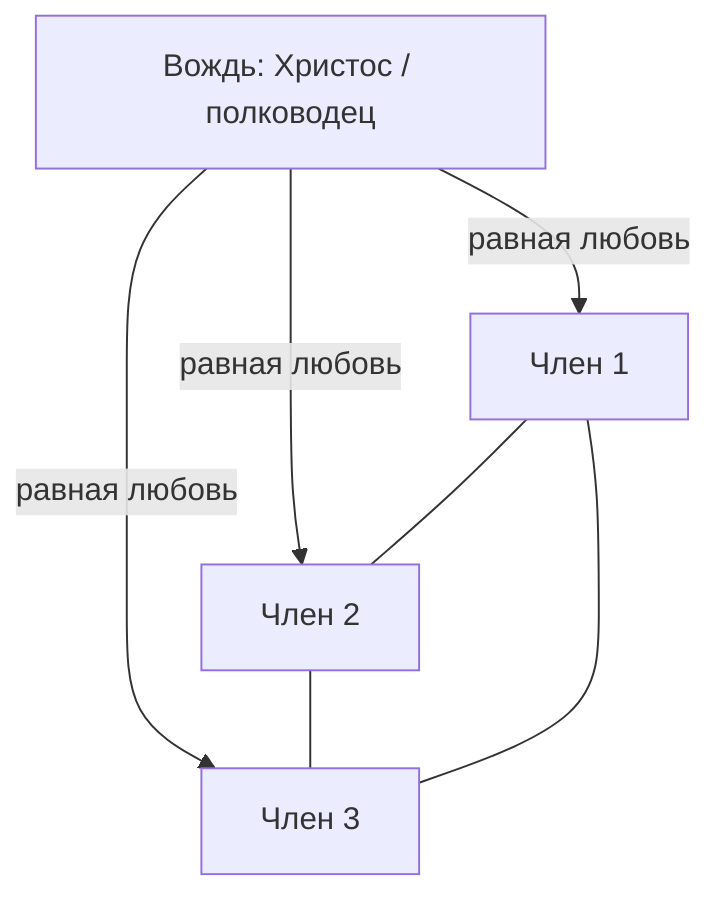

Оригинал:: Sigm. Freud, Massenpsychologie und Ich-Analyse. Internationaler Psychoanalytischer Verlag, Leipzig–Wien–Zürich, 1921.
Конспект:: [[Групповая психология и анализ Я — конспект, Фрейд, 1921]]
Готовый перевод на русском (для сверки/чтения): [Проект «Весь Фрейд»](https://freudproject.ru/?p=1248)

Изложение с немецкого оригинала (общественное достояние, archive.org `Freud_1921_Massenpsychologie_und_Ich_Analyse_k` = Gutenberg #30843) для настоящего хранилища. Формат — сплошной ход книги по главам, каждая отдельная мысль дана как **Тезис / Аргументы / Вывод** и снабжена block-id `^pN`, на который ссылается соответствующая атомарная заметка.

Статус: изложено полностью, главы I–XII.

---

## Главы I–II. Введение и описание массовой души у Лебона

**Тезис.** Противоположность индивидуальной и социальной (массовой) психологии, на первый взгляд кажущаяся весьма значительной, при ближайшем рассмотрении сильно теряет свою резкость.

**Аргументы.** Индивидуальная психология настроена на отдельного человека и прослеживает пути, какими он ищет удовлетворения своих влечений, — но лишь в редких, особых случаях ей удаётся отвлечься от отношений этого человека к другим людям. В душевной жизни отдельного человека вполне регулярно фигурирует Другой — как образец, как объект, как помощник и как противник, — и потому индивидуальная психология с самого начала есть одновременно и социальная психология в этом расширенном, но вполне правомерном смысле. Отношение отдельного человека к родителям и братьям-сёстрам, к любимому объекту и к врачу — то есть все связи, преимущественно бывшие до сих пор предметом психоаналитического исследования, — вправе претендовать на оценку как социальные феномены и тем самым противопоставляются определённым другим процессам, называемым нарциссическими, при которых удовлетворение влечения обходится без влияния других лиц или отказывается от них. Противоположность социальных и нарциссических (Блейлер, возможно, сказал бы: аутистических) душевных актов полностью помещается внутри области индивидуальной психологии и не годится, чтобы отделить её от социальной или массовой психологии.

**Вывод.** Раз индивидуальная психология уже по своей природе социальна, само деление на «индивидуальную» и «массовую» психологию нуждается в переопределении — и это переопределение Фрейд даёт через понятие числа и характера связи с другими людьми, а не через саму социальность как таковую. ^p1

**Тезис.** В упомянутых отношениях к родителям и братьям-сёстрам, к возлюбленной, к другу и к врачу отдельный человек испытывает влияние лишь одного или очень немногих лиц, каждое из которых приобрело для него огромное значение. Когда же говорят о социальной или массовой психологии, принято отвлекаться от этих отношений и выделять предметом исследования одновременное влияние на отдельного человека большого числа лиц, с которыми его что-то связывает, хотя в остальном они могут быть ему чужды.

**Аргументы.** Массовая психология рассматривает отдельного человека как члена племени, народа, касты, сословия, института или как часть человеческого скопления, организовавшегося в определённое время для определённой цели в массу. После такого разрыва естественной связи напрашивалось рассматривать явления, обнаруживающиеся при этих особых условиях, как проявления особого, далее не сводимого влечения — социального влечения (herd instinct, group mind), не проявляющегося в иных ситуациях. Но можно возразить: трудно допустить, чтобы одному лишь моменту числа было по силам разбудить в душевной жизни человека новое, иначе не действующее влечение. Ожидание поэтому направляется на две другие возможности: что социальное влечение не изначально и не является неразложимым, и что начала его образования можно найти в более узком кругу — например, в семье. Массовая психология, хотя пока лишь в своих начатках, охватывает необозримое множество отдельных проблем и ставит перед исследователем бесчисленные, пока даже толком не разграниченные задачи; уже одна группировка различных форм массообразования и описание проявляемых ими психических феноменов требуют огромной затраты наблюдения и изложения и уже породили обширную литературу. Кто станет мерить эту тонкую книжицу объёмом массовой психологии в целом, легко догадается, что здесь будут разобраны лишь немногие пункты всего материала, — в самом деле, лишь несколько вопросов, к которым глубинное исследование психоанализа проявляет особый интерес.

**Вывод.** Фрейд сразу отклоняет идею отдельного, несводимого «социального влечения» и заявляет программу книги: не описывать массу как целое явление, а искать корни массовой психологии в уже известных психоанализу семейных, диадических отношениях — задача скромная по заявленному объёму, но амбициозная по методу. ^p2

**Тезис.** Вместо того чтобы начинать с определения, целесообразнее начать с указания на область явлений и выделить из неё некоторые особенно бросающиеся в глаза и характерные факты, к которым может примкнуть исследование. И то и другое достигается выдержкой из по праву прославленной книги Лебона «Психология масс».

**Аргументы.** Если бы психология, прослеживающая задатки, движения влечений, мотивы и намерения отдельного человека вплоть до его поступков и отношений с ближними, полностью решила свою задачу и сделала все эти связи прозрачными, она внезапно оказалась бы перед новой, ещё не решённой задачей: ей пришлось бы объяснить удивительный факт, что этот ставший ей понятным индивид при определённом условии чувствует, думает и действует совершенно иначе, чем от него можно было ожидать, — и это условие есть включение в человеческую массу, приобретшую свойство «психологической массы». Что же такое «масса», чем она приобретает способность так решающе влиять на душевную жизнь отдельного человека, и в чём состоит то душевное изменение, которое она ему навязывает? Ответить на эти три вопроса — задача теоретической массовой психологии; удобнее всего подступиться к ней, начав с третьего вопроса. Лебон пишет: самое странное в психологической массе то, что, каковы бы ни были составляющие её индивиды, сколь бы ни было сходно или несходно их занятие, характер или интеллект, самим фактом превращения в массу они приобретают коллективную душу, в силу которой чувствуют, думают и действуют совершенно иначе, чем каждый из них чувствовал бы, думал и действовал бы порознь. Есть идеи и чувства, возникающие или переходящие в действия лишь у объединённых в массу индивидов; психологическая масса — временное существо, состоящее из разнородных элементов, на миг соединившихся друг с другом совершенно так же, как клетки организма своим объединением образуют новое существо с совсем иными свойствами, чем у отдельных клеток. Прерывая изложение Лебона собственной репликой, Фрейд замечает: если индивиды в массе связаны в единство, должно существовать нечто, что их связывает друг с другом, и это связующее средство могло бы быть как раз тем, что характерно для массы, — но Лебон на этот вопрос не отвечает, а переходит к описанию изменения индивида в массе в выражениях, хорошо согласующихся с основными предпосылками глубинной психологии.

**Вывод.** Уже в этой первой критической реплике намечена стратегия всей книги: Фрейд принимает описательный материал Лебона как достоверный, но упрекает его в том, что он не задаёт (и тем более не отвечает на) главный вопрос — что именно связывает индивидов в массе; именно на этот пропущенный вопрос и будет отвечать вся дальнейшая книга. ^p3

**Тезис.** Установить меру различия между индивидом, принадлежащим массе, и изолированным индивидом легко; труднее обнаружить причины этого различия.

**Аргументы.** Чтобы хоть отчасти найти эти причины, нужно вспомнить установленный современной психологией факт, что не только в органической жизни, но и в интеллектуальных функциях преобладающую роль играют бессознательные явления. Сознательная духовная жизнь составляет лишь весьма малую часть рядом с бессознательной душевной жизнью; тончайший анализ, острейшее наблюдение достигают лишь небольшого числа сознательных мотивов душевной жизни. Наши сознательные акты происходят из бессознательного субстрата, созданного прежде всего влияниями наследственности; он содержит бесчисленные следы предков, из которых складывается расовая душа. За признаваемыми мотивами наших поступков несомненно лежат тайные причины, которых мы не признаём, а за ними — ещё более тайные, которых мы даже не знаем; большинство наших повседневных действий есть лишь следствие скрытых, ускользающих от нас мотивов. В массе, полагает Лебон, стираются индивидуальные приобретения отдельных людей, и вместе с этим исчезает их своеобразие: выступает расовое бессознательное, разнородное тонет в однородном. Так возникает средний характер индивидов массы. Но Лебон находит, что они обнаруживают и новые свойства, которых прежде не имели, и ищет причину этого в трёх различных моментах: первая из этих причин состоит в том, что индивид в массе уже самим фактом множества обретает ощущение непреодолимой силы, позволяющее ему предаваться влечениям, которые в одиночку он неизбежно сдерживал бы, — тем более что при анонимности, а тем самым и безответственности массы полностью исчезает чувство ответственности, всегда сдерживающее отдельного человека.

**Вывод.** Фрейд принимает описание Лебона (снятие вытеснения бессознательных влечений, исчезновение чувства ответственности = «социальной тревоги»), но отмечает существенное расхождение в самом понятии бессознательного: у Лебона бессознательное — это прежде всего расовая душа, тогда как психоанализ дополнительно выделяет «бессознательное вытесненное», отсутствующее у Лебона вовсе. ^p4

**Тезис.** Третья, и притом важнейшая причина обусловливает у объединённых в массу индивидов особые свойства, прямо противоположные свойствам изолированного индивида, — Лебон называет её внушаемостью, следствием которой оказывается уже упомянутое заражение.

**Аргументы.** Для понимания этого явления нужно вспомнить некоторые новые открытия физиологии: человека посредством различных процедур можно привести в такое состояние, что он, утратив всю свою сознательную личность, подчиняется всем внушениям того, кто лишил его сознания собственной личности, и совершает поступки, находящиеся в резчайшем противоречии с его характером и привычками. Тщательные наблюдения показывают, что индивид, некоторое время пребывающий в недрах активной массы, вскоре — то ли под воздействием исходящих от неё излучений, то ли по иной неизвестной причине — оказывается в особом состоянии, весьма близком к фасцинации, охватывающей загипнотизированного под влиянием гипнотизёра: сознательная личность полностью исчезает, воля и способность к различению отсутствуют, все чувства и мысли ориентированы в направлении, заданном гипнотизёром. Примерно так же обстоит дело и с состоянием индивида, принадлежащего психологической массе: он больше не сознаёт своих действий; как у загипнотизированного, у него одни способности упраздняются, тогда как другие достигают высшей степени силы; под влиянием внушения он с неодолимым порывом примется исполнять определённые действия — и этот порыв в массах ещё неодолимее, чем у загипнотизированного, потому что одинаковое для всех индивидов внушение возрастает через взаимность. Главные признаки индивида, находящегося в массе: исчезновение сознательной личности, преобладание бессознательной личности, ориентация мыслей и чувств в одном направлении через внушение и заражение, тенденция к немедленному осуществлению внушённых идей; индивид перестаёт быть самим собой, становится автоматом без воли. Фрейд намеренно приводит цитату так подробно, чтобы подтвердить: Лебон действительно объявляет состояние индивида в массе гипнотическим, а не просто сравнивает его с ним. Фрейд не намерен здесь спорить, но хочет подчеркнуть: две последние причины изменения индивида в массе — заражение и повышенная внушаемость — явно неоднородны, поскольку заражение само должно быть проявлением внушаемости; действия обоих моментов у Лебона тоже кажутся недостаточно чётко разграниченными. Возможно, лучше всего истолковать его слова так: заражение отнести к воздействию отдельных членов массы друг на друга, тогда как приравненные к гипнотическому влиянию явления внушения в массе указывают на другой источник. Но на какой именно? Здесь бросается в глаза чувствительная неполнота: одна из главных частей этого уподобления — лицо, заменяющее для массы гипнотизёра, — в изложении Лебона вовсе не упоминается.

**Вывод.** Это — решающий момент всей книги: Фрейд находит именно тот пробел в теории Лебона, который сам и заполнит, — Лебон описывает массу как гипнотическое состояние, но не называет гипнотизёра; вся дальнейшая аргументация Фрейда будет строиться вокруг того, что этим недостающим «гипнотизёром» оказывается вождь, а связь с ним — либидинозная привязанность, а не абстрактное «внушение». ^p5

**Тезис.** Ещё один важный пункт для оценки массового индивида: одной лишь принадлежностью к организованной массе человек спускается на несколько ступеней по лестнице цивилизации.

**Аргументы.** В своей отдельности он, возможно, был образованным индивидом — в массе он варвар, то есть **существо влечения** (Triebwesen). Ему свойственны спонтанность, необузданность, дикость, но также энтузиазм и героизм первобытных существ. Особо Лебон останавливается на снижении интеллектуальной работы, которое отдельный человек испытывает от растворения в массе. Фрейд подкрепляет это двустишием Шиллера: каждый по отдельности сносно умён и рассудителен, но собранные вместе (in corpore) они тут же превращаются в дурака.

**Вывод.** Утрата культурного слоя в массе — не риторическая фигура, а описание регрессии: масса возвращает индивида к более раннему, влечёнческому уровню душевной организации. Именно поэтому всё дальнейшее описание массовой души у Лебона без всякого труда ложится на психоаналитическое описание примитивных народов и детей — что Фрейд и делает в следующем шаге. ^p6

**Тезис.** Оставив отдельного человека и перейдя к самому описанию массовой души, Фрейд констатирует: в нарисованной Лебоном картине нет ни одной черты, вывод и размещение которой составили бы для психоаналитика трудность, — Лебон сам указывает путь, отмечая совпадение массовой души с душевной жизнью примитивных народов и детей.

**Аргументы.** Масса импульсивна, изменчива и раздражительна, ведома почти исключительно бессознательным (Фрейд отмечает в сноске: Лебон употребляет слово «бессознательное» правильно, в описательном смысле, где оно означает не одно только «вытесненное»). Импульсы, которым масса подчиняется, могут быть, смотря по обстоятельствам, благородными или жестокими, героическими или трусливыми, но во всяком случае настолько повелительными, что не проявляется ни личный интерес, ни даже интерес самосохранения. Ничего у неё не обдумано заранее. Страстно желая вещей, она никогда не желает их долго: она неспособна к длительной воле и не выносит отсрочки между желанием и осуществлением желаемого. У неё есть **чувство всемогущества**: для индивида в массе исчезает само понятие невозможного — здесь Фрейд прямо отсылает к «Тотему и табу» (раздел III: анимизм, магия и всемогущество мыслей).

**Вывод.** Отождествление массовой души с душой примитивного человека — не метафора и не оценочное суждение, а рабочая гипотеза: всё, что психоанализ уже знает о всемогуществе мыслей, о нетерпимости к отсрочке и о власти бессознательного, становится готовым инструментом для объяснения массы. ^p7

**Тезис.** Масса чрезвычайно подвержена влиянию и легковерна, она **некритична**: невероятного для неё не существует.

**Аргументы.** Она мыслит образами, которые вызывают друг друга по ассоциации — так же, как это происходит у отдельного человека в состояниях свободного фантазирования, — и эти образы не измеряются никакой рассудочной инстанцией на соответствие действительности. Чувства массы всегда очень просты и очень безудержны. Отсюда главный вывод: масса не знает ни сомнения, ни неуверенности. Фрейд подкрепляет это собственным техническим правилом из «Толкования сновидений»: при толковании мы отвлекаемся от сомнений и неуверенности в рассказе сновидца и трактуем каждый элемент явного сновидения как одинаково достоверный. Сомнение и неуверенность мы выводим из воздействия цензуры, которой подлежит работа сновидения, и предполагаем, что **первичные мысли сновидения сомнения и неуверенности как критического действия не знают** (как содержания они, конечно, могут попадать в сновидение вместе с дневными остатками).

**Вывод.** Отсутствие сомнения у массы — не глупость её членов, а структурная черта: сомнение есть продукт критической инстанции, а в массе (как и в первичном процессе сновидения) эта инстанция не работает. Это первая из параллелей, которыми Фрейд систематически подшивает описание Лебона к уже готовой метапсихологии. ^p8

**Тезис.** Масса немедленно переходит к крайности: высказанное подозрение тут же превращается у неё в непоколебимую уверенность, зачаток антипатии — в дикую ненависть.

**Аргументы.** Точно такое же возведение всех чувственных движений к крайнему и безмерному принадлежит аффективности ребёнка и вновь обнаруживается в жизни сновидений: благодаря господствующей в бессознательном **изоляции отдельных чувственных движений** лёгкая дневная досада выражается как желание смерти виновному лицу, а намёк на какое-то искушение становится толчком к представленному в сновидении преступному действию. Фрейд приводит здесь замечание Ганса Закса: то, что сновидение открыло нам о своих отношениях к настоящему (к реальности), мы затем хотим отыскать и в сознании — и не должны удивляться, если чудовище, которое мы видели под увеличительным стеклом анализа, обнаружится там инфузорией.

**Вывод.** Безмерность аффектов массы объясняется не «заразительностью страсти» самой по себе, а тем же механизмом, что и в сновидении и у ребёнка: в бессознательном отдельное чувственное движение изолировано и потому не сдерживается противоположными ему. Масштаб чувства в массе — не мера его реального повода. ^p9

**Тезис.** Сама склонная ко всем крайностям, масса и возбуждается только чрезмерными раздражителями.

**Аргументы.** Кто хочет на неё воздействовать, тот не нуждается в логической выверенности своих доводов: он должен **писать сильнейшими образами, преувеличивать и всё время повторять одно и то же**. Это прямое следствие двух уже описанных черт — мышления образами вместо понятий и отсутствия критической инстанции, которая измеряла бы сказанное на соответствие действительности.

**Вывод.** Техника обращения к массе выведена не из наблюдений над ораторским искусством, а из строения самой массовой души: аргумент бессилен там, где нет сомнения, и потому его место занимают образ, преувеличение и повторение. Это описание Фрейд принимает целиком — его собственное возражение Лебону касается не *как* воздействуют на массу, а *кто* и *почему* обладает такой властью. ^p10

**Тезис.** Поскольку масса не знает сомнения в истинном и ложном и при этом сознаёт свою огромную силу, она столь же нетерпима, сколь и склонна верить авторитету.

**Аргументы.** Она уважает силу, а добротой, которая означает для неё лишь разновидность слабости, поддаётся влиянию только умеренно. От своих героев она требует **силы, даже насильственности**. Она хочет быть управляемой и подавляемой и хочет бояться своего господина. В основе своей вполне консервативная, она питает глубокое отвращение ко всем новшествам и успехам и безграничное благоговение перед традицией.

**Вывод.** Это описание — важнейшая заготовка для всей последующей теории вождя: потребность массы в господине здесь зафиксирована как эмпирический факт, но у Лебона она остаётся необъяснённой (инстинкт стада), тогда как Фрейд позже выведет её из либидинозной привязанности к отцу первобытной орды. ^p11

**Тезис.** Чтобы верно судить о нравственности масс, нужно учесть, что она может отклоняться от индивидуальной нормы **в обе стороны** — и вниз, и вверх.

**Аргументы.** При совместном пребывании массовых индивидов отпадают все индивидуальные торможения, и все жестокие, брутальные, разрушительные инстинкты, дремлющие в отдельном человеке как пережиток первобытных времён, пробуждаются к свободному удовлетворению влечений. Но масса под влиянием внушения способна и на высокие свершения самоотречения, бескорыстия, преданности идеалу. Если у изолированного индивида личная выгода — едва ли не единственная движущая пружина, то у масс она преобладает очень редко: можно говорить об **«оморализации» отдельного человека массой** (Versittlichung). Асимметрия здесь принципиальна:

![[Нравственность массы (Фрейд, 1921).svg]]

**Вывод.** Масса не есть просто «худшая версия» индивида: интеллектуально она всегда проигрывает, нравственно — способна и на большее, чем каждый из её членов порознь. Это наблюдение готовит место для будущей роли Я-идеала: то, что поднимает нравственность массы, окажется не силой внушения как таковой, а общим идеалом, поставленным на место собственного Я-идеала каждого. ^p12

**Тезис.** У масс самые противоположные идеи могут существовать бок о бок и уживаться друг с другом без того, чтобы из их логического противоречия возник конфликт, — ровно то же самое давно доказано психоанализом для бессознательной душевной жизни отдельного человека, детей и невротиков.

**Аргументы.** У маленького ребёнка амбивалентные чувственные установки к ближайшим людям долгое время сосуществуют, и одна не мешает выражению противоположной; если дело наконец доходит до конфликта, он часто улаживается тем, что ребёнок меняет объект, смещая одно из амбивалентных движений на замещающий объект. Из истории развития невроза у взрослого видно то же: подавленное движение нередко долго продолжается в бессознательных или даже сознательных фантазиях, содержание которых прямо противоречит господствующему стремлению, и это противоречие не вызывает вмешательства Я против отвергаемого им — фантазия какое-то время терпится, пока внезапно, обычно вследствие усиления её аффективной нагрузки, не устанавливается конфликт между нею и Я со всеми последствиями. В ходе развития от ребёнка к зрелому взрослому вообще происходит всё более широко захватывающая **интеграция личности** — сведение воедино отдельных, независимо друг от друга выросших движений влечений и целевых стремлений. Аналогичный процесс в области половой жизни давно известен как объединение всех сексуальных влечений в окончательную генитальную организацию ([[Три очерка — конспект, Фрейд, 1905|«Три очерка по теории сексуальности»]], 1905). Что объединение Я может испытывать те же нарушения, что и объединение либидо, показывают многочисленные известные примеры — например, естествоиспытатели, оставшиеся верующими в Библию.

**Вывод.** Единство личности — не исходная данность, а позднее и хрупкое достижение развития. Масса просто возвращает человека в состояние до этой интеграции: в ней сосуществуют несовместимые идеи ровно так же, как в бессознательном ребёнка или невротика. ^p13

**Тезис.** Масса подчинена поистине **магической власти слов**, способных вызывать в массовой душе страшнейшие бури и точно так же их усмирять.

**Аргументы.** Разумом и доводами против известных слов и формул бороться нельзя: их произносят перед массами с благоговением — и тотчас лица становятся почтительными, а головы склоняются; многими они воспринимаются как силы природы или как сверхъестественные могущества. Достаточно вспомнить, замечает Фрейд, о табу имён у примитивных народов и о магических силах, которые связываются у них с именами и словами (отсылка к «Тотему и табу»).

**Вывод.** Слово в массе действует не как носитель смысла, а как вещь, обладающая силой, — так же, как имя у примитивного человека. Это ещё одно звено в цепи, которой Фрейд пришивает описание Лебона к психоанализу: массовая душа не «иррациональна» в смысле беспорядочности, она подчинена другому, архаическому порядку. ^p14

**Тезис.** И наконец: массы никогда не знали жажды истины. Они требуют иллюзий, от которых не могут отказаться.

**Аргументы.** Ирреальное всегда имеет у них преимущество перед реальным, недействительное влияет на них почти так же сильно, как действительное; у них есть явная тенденция не делать между тем и другим никакого различия. Это господство жизни фантазии и питаемой неисполненным желанием иллюзии Фрейд уже показал как определяющее для психологии неврозов: для невротика значима не общая объективная, а **психическая реальность**. Истерический симптом основывается на фантазии, а не на повторении действительно пережитого; навязчивое сознание вины опирается на факт злого намерения, никогда не приведённого в исполнение. Как в сновидении и в гипнозе, в душевной деятельности массы **проверка реальности отступает** перед силой аффективно нагруженных желаний.

**Вывод.** Здесь параллель «масса — невротик» достигает предела: масса живёт в психической реальности. Это объясняет и её невосприимчивость к опровержениям, и то, почему её нельзя переубедить фактами, — но одновременно ставит вопрос, который Фрейд решит только в конце книги: чем же именно масса всё-таки *отличается* от невроза (см. [[Невроз стоит вне ряда влюблённость-гипноз-группа у Фрейда]]). ^p15

**Тезис.** То, что Лебон говорит о вождях масс, гораздо менее исчерпывающе, чем его описание самой массовой души, и закономерность здесь просвечивает не так отчётливо.

**Аргументы.** По Лебону, как только живые существа соединяются в некотором числе — безразлично, стадо ли это животных или человеческая толпа, — они инстинктивно ставят себя под авторитет главы. Масса есть послушное стадо, которое никогда не в состоянии жить без господина; у неё такая жажда повиноваться, что она инстинктивно подчиняется каждому, кто объявит себя её господином. Но если потребность массы идёт вождю навстречу, он всё же должен ей соответствовать личными качествами: он сам должен быть заворожён сильной верой (в идею), чтобы пробудить веру в массе, и должен обладать сильной, импонирующей волей, которую безвольная масса от него перенимает. Лебон разбирает далее различные типы вождей и средства их воздействия на массу, в целом выводя их значение из идей, которыми они сами фанатизированы.

**Вывод.** У Лебона потребность в вожде остаётся конечной, необъяснимой данностью — «инстинктом» стада; сам вождь получает свою власть от идеи, которой он одержим. Именно эту точку Фрейд считает нерешённой и будет решать через либидо: не идея делает вождя, а либидинозная связь членов массы с ним и, через него, друг с другом. ^p16

**Тезис.** И идеям, и вождям Лебон приписывает сверх того таинственную, неотразимую власть, которую называет **престижем**.

**Аргументы.** Престиж — это род господства, которое индивид, произведение или идея осуществляет над нами: оно парализует всю нашу способность к критике и наполняет нас изумлением и почтением; оно должно вызывать чувство, подобное фасцинации в гипнозе. Лебон различает две его формы:

![[Престиж (Фрейд, 1921).svg]]

При этом всякий престиж зависит от успеха и теряется от неудач. Фрейд заключает главу собственной оценкой: не возникает впечатления, что роль вождей и подчёркивание престижа приведены у Лебона в правильное согласие со столь блистательно изложенным описанием массовой души.

**Вывод.** Итог главы II — двойной: описание массовой души Фрейд принимает целиком и находит для каждой её черты психоаналитический эквивалент, но объяснительная часть Лебона (внушение, престиж, инстинкт стада) объявлена несостоятельной — она не связана с самим описанием. Оставшийся пробел (масса ведёт себя как загипнотизированная, но гипнотизёр не назван, а «престиж» лишь переименовывает загадку) и есть то место, куда Фрейд поставит либидо. ^p17

## Глава III. Другие оценки коллективной душевной жизни

**Тезис.** Изложением Лебона Фрейд воспользовался как введением — потому что оно в своём подчёркивании бессознательной душевной жизни так сильно совпадает с психоанализом; но нужно добавить, что, собственно говоря, ни одно из утверждений этого автора не приносит ничего нового.

**Аргументы.** Всё уничижительное и принижающее, что Лебон говорит о проявлениях массовой души, столь же определённо и столь же враждебно было сказано до него другими и с древнейших времён литературы одинаково повторяется мыслителями, государственными деятелями и поэтами. Два положения, содержащие важнейшие взгляды Лебона, — о коллективном торможении интеллектуальной работы и о повышении аффективности в массе — были незадолго до него сформулированы Сигеле. По сути, как собственно лебоновское остаются лишь **две точки зрения: бессознательное и сравнение с душевной жизнью примитивных народов** — да и их, конечно, часто затрагивали до него.

**Вывод.** Ценность Лебона для Фрейда — не в новизне, а в направлении: он единственный из авторов о массе, кто разворачивает описание в сторону бессознательного и архаического, то есть туда, где психоанализ может подхватить работу. Всё остальное — общее место, которому две тысячи лет. ^p18

**Тезис.** Описание и оценка массовой души, какую дают Лебон и другие, отнюдь не остались неоспоренными: наблюдения верны, но обнаруживаются и прямо противоположные по действию проявления массообразования, из которых приходится выводить куда более высокую оценку массовой души.

**Аргументы.** Сам Лебон готов был признать, что нравственность массы при известных условиях может быть выше, чем у составляющих её отдельных людей, и что только совокупности способны на высокое бескорыстие и преданность: если у изолированного индивида личная выгода — почти единственная движущая пружина, то у масс она преобладает очень редко. Другие идут дальше и указывают, что **вообще только общество предписывает отдельному человеку нормы нравственности**, тогда как сам он, как правило, чем-нибудь да отстаёт от этих высоких требований; или что в исключительных состояниях в коллективе возникает феномен воодушевления, сделавший возможными величайшие массовые свершения. Что до интеллектуальной работы — остаётся верным, что великие решения мыслительной работы, чреватые последствиями открытия и решения проблем возможны только отдельному человеку, работающему в одиночестве. Но и массовая душа способна на гениальные духовные создания: прежде всего это доказывает **сам язык**, а затем народная песня, фольклор и прочее. Сверх того остаётся открытым, сколь многим отдельный мыслитель или поэт обязан побуждениям массы, в которой он живёт, и не является ли он скорее лишь завершителем душевной работы, в которой одновременно участвовали другие.

**Вывод.** Позиции полностью противоречат друг другу — и это противоречие, а не согласие, оказывается продуктивной точкой: оно заставит различать *разные типы* масс вместо одной «массовой души вообще». ^p19

**Тезис.** Перед лицом этих совершенных противоречий кажется, будто работа массовой психологии обречена остаться безрезультатной; но из положения легко найти более обнадёживающий выход — вероятно, под словом «массы» свели вместе очень разные образования, которые нуждаются в разделении.

**Аргументы.** Данные Сигеле, Лебона и других относятся к массам **кратковременного рода**, быстро сбиваемым воедино из разнородных индивидов преходящим интересом; несомненно, что на их описания повлияли черты революционных масс, особенно масс Великой французской революции. Противоположные же утверждения происходят из оценки тех **устойчивых масс или сообществ**, в которых люди проводят свою жизнь и которые воплощены в институтах общества. Массы первого рода как бы насажены на массы второго —

![[Два типа масс — волны поверх длинной зыби (Фрейд, 1921).svg]]

— как короткие, но высокие волны поверх длинной зыби моря.

**Вывод.** Противоречие между «масса ниже индивида» и «масса выше индивида» снимается не выбором одной из сторон, а различением объектов: описания Лебона верны для мимолётной толпы, возражения — для устойчивых образований. Отсюда прямой путь к следующему вопросу: что именно превращает толпу в устойчивую массу (у Макдугалла — организация). ^p20

**Тезис.** Макдугалл, исходящий в книге «The Group Mind» (1920) из того же противоречия, находит его решение **в моменте организации**.

**Аргументы.** В простейшем случае, говорит он, масса (group) не обладает вообще никакой организацией или обладает едва заметной — такую массу он обозначает как **кучу (crowd)**. Впрочем, он признаёт, что куча людей нелегко сходится без того, чтобы в ней не образовались хотя бы первые зачатки организации, и что как раз на этих простых массах некоторые основные факты коллективной психологии особенно легко распознаются. Чтобы из случайно сдутых вместе членов человеческой кучи образовалось нечто вроде массы в психологическом смысле, требуется как условие, чтобы эти отдельные люди имели **нечто общее друг с другом**: общий интерес к какому-то объекту, однородное направление чувства в известной ситуации и (Фрейд вставляет от себя: вследствие этого) известную меру способности влиять друг на друга. Чем сильнее эта общность (mental homogeneity), тем легче из отдельных людей образуется психологическая масса и тем заметнее проявляются обнаружения массовой души.

**Вывод.** Различие «куча — организованная масса» позволяет объяснить обе оценки одним понятием, но само понятие общности у Макдугалла остаётся описательным: «общий интерес к объекту» — это ровно то место, куда Фрейд затем поставит общий объект, занявший место Я-идеала. ^p21

**Тезис.** Самый примечательный и вместе с тем важнейший феномен массообразования — вызываемое у каждого отдельного человека **повышение аффективности** (exaltation or intensification of emotion).

**Аргументы.** Едва ли при других условиях аффекты людей вырастают до такой высоты, как это происходит в массе, — и притом для участников это наслаждение: столь безгранично отдаваться своим страстям и при этом растворяться в массе, теряя чувство своей индивидуальной отграниченности. Это захваченность индивидов Макдугалл объясняет названным им «принципом прямой индукции аффекта путём первобытного симпатического отклика» (principle of direct induction of emotion by way of the primitive sympathetic response), то есть уже известным нам чувственным заражением. Механизм таков:

![[Взаимная индукция аффекта в массе (Фрейд, 1921).svg]]

Этот автоматический принудительный ход тем сильнее, чем у большего числа лиц одновременно заметен один и тот же аффект: тогда критика отдельного человека умолкает, и он соскальзывает в тот же аффект — но при этом повышает возбуждение тех, кто подействовал на него, и так аффективная нагрузка отдельных лиц возрастает через **взаимную индукцию**. Здесь несомненно действует нечто вроде принуждения делать то же, что другие, оставаться в согласии со многими. При этом более грубые и простые чувственные движения имеют больше шансов распространиться в массе таким образом.

**Вывод.** Заражение перестаёт быть загадочным «излучением» и получает описываемый механизм — круговую взаимную индукцию, в которой каждый одновременно приёмник и усилитель. Отбор по грубости чувства объясняет, почему массы объединяются вокруг простейших аффектов, а не сложных. ^p22

**Тезис.** Механизм повышения аффекта поддерживается ещё несколькими исходящими от массы влияниями — и здесь Фрейд впервые предлагает собственное объяснение вместо описания чужого.

**Аргументы.** Масса производит на отдельного человека впечатление неограниченной власти и непобедимой опасности. **Она на мгновение поставила себя на место всего человеческого общества** — того носителя авторитета, чьих наказаний боялись и ради которого налагали на себя столько торможений. Очевидно опасно вступать с ней в противоречие, и безопасно — следовать показываемому со всех сторон примеру, то есть в крайнем случае даже «выть с волками». В послушании новому авторитету можно вывести из действия свою прежнюю **совесть** и при этом поддаться соблазну выигрыша удовольствия, который наверняка получают через отмену собственных торможений. Поэтому в целом не так уж удивительно, когда мы видим, как отдельный человек в массе делает или одобряет вещи, от которых в привычных условиях жизни отвернулся бы.

**Вывод.** Здесь Фрейд впервые прямо заявляет свою программу: таким образом можно осветить часть той темноты, которую принято прикрывать загадочным словом **«внушение»**. Загадка внушения решается не новой силой, а перестановкой инстанций — масса занимает место общества, а значит и место той внутренней инстанции, которая от общества происходит (позже она будет названа Я-идеалом). ^p23

**Тезис.** Положению о коллективном торможении интеллекта в массе Макдугалл не противоречит; его общее суждение о душевной работе простой, «неорганизованной» массы звучит не дружелюбнее, чем у Лебона.

**Аргументы.** Меньшие интеллекты стягивают большие на свой уровень; большие оказываются заторможены в своей деятельности по трём причинам: повышение аффективности вообще создаёт неблагоприятные условия для корректной умственной работы; отдельные люди запуганы массой, и их мыслительная работа несвободна; у каждого снижено сознание ответственности за собственный результат. Портрет такой массы у Макдугалла: чрезвычайно возбудимая, импульсивная, страстная, переменчивая, непоследовательная, нерешительная и при этом готовая на крайности в своих действиях, доступная только для более грубых страстей и простых чувств, чрезвычайно внушаемая, легкомысленная в своих соображениях, резкая в суждениях, восприимчивая лишь к простейшим и несовершеннейшим выводам и доводам, легко управляемая и легко потрясаемая, без самосознания, самоуважения и чувства ответственности, но готовая позволить своему сознанию силы увлечь себя ко всем злодеяниям, каких только можно ожидать от абсолютной и безответственной власти. Она ведёт себя скорее как невоспитанный ребёнок или как страстный, оставленный без присмотра дикарь в чуждой ему ситуации; в худших случаях её поведение — скорее поведение стаи диких зверей, чем человеческих существ.

**Вывод.** Единственная защита от коллективного снижения интеллекта, которую видит Макдугалл, — техническая: изъять решение интеллектуальных задач у массы и оставить его отдельным лицам внутри неё. Это уже подводит к вопросу, что вообще меняет организация, — и Фрейд ответит на него переописанием самого понятия. ^p24

**Тезис.** Поскольку Макдугалл противопоставляет поведение высокоорганизованных масс описанному портрету неорганизованной кучи, важно узнать, в чём же состоит эта организация; он перечисляет **пять «principal conditions»** подъёма душевной жизни массы на более высокий уровень.

**Аргументы.**

![[Пять условий организации массы по Макдугаллу (Фрейд, 1921).svg]]

При выполнении этих условий, по Макдугаллу, психические невыгоды массообразования снимаются.

**Вывод.** Список Макдугалла точен как наблюдение, но остаётся внешним перечнем признаков — он говорит, при каких условиях масса ведёт себя лучше, но не говорит, что за душевная сила при этом действует. Фрейд немедленно предложит другое, более содержательное описание того же самого. ^p25

**Тезис.** То условие, которое Макдугалл обозначил как «организацию» массы, можно с бо́льшим правом описать иначе: **задача состоит в том, чтобы доставить массе как раз те свойства, которые были характерны для индивида и которые у него были погашены массообразованием**.

**Аргументы.** Ведь индивид — вне примитивной массы — имел свою континуальность, своё самосознание, свои традиции и привычки, свою особую работу и своё место в общем строю, и держался отдельно от других, с которыми соперничал. Эту свою особость он на время утратил, вступив в «неорганизованную» массу. Пять условий Макдугалла ложатся на утраченные свойства индивида одно к одному — континуальность, представление о себе, отграниченность от других и соперничество, традиции, разделение труда. Если признать целью снабжение массы атрибутами индивида, вспоминается содержательное замечание У. Троттера («Instincts of the herd in peace and war», 1916), который усматривает в склонности к массообразованию **биологическое продолжение многоклеточности** всех высших организмов.

**Вывод.** Организованная масса — не что иное, как масса, ставшая индивидом: развитие идёт не от индивида к массе и обратно, а по одной линии сложения единиц в единицу более высокого порядка. Это переописание закрывает главу III и подготавливает главу IV, где Фрейд, отвергнув «внушение» как последнее объяснение, поставит на его место либидо. ^p26

## Глава IV. Внушение и либидо

**Тезис.** Мы исходили из основного факта: отдельный человек внутри массы под её влиянием испытывает часто глубоко идущее изменение своей душевной деятельности — и теперь наш интерес направлен на то, чтобы найти для этого изменения **психологическое объяснение**.

**Аргументы.** Аффективность его чрезвычайно повышается, интеллектуальная работа заметно ограничивается, и оба процесса явно идут в направлении **уподобления остальным массовым индивидам**. Такой результат может быть достигнут только через снятие свойственных каждому отдельному человеку торможений влечений и через отказ от особых, ему одному присущих оформлений его склонностей. Мы слышали, что эти часто нежелательные действия хотя бы отчасти сдерживаются более высокой «организацией» масс, но самому основному факту массовой психологии — двум положениям о повышении аффекта и торможении мысли в примитивной массе — это не противоречит.

**Вывод.** Задача сформулирована предельно узко и потому решаемо: объяснить надо не «массу вообще», а один процесс — почему индивид отказывается от собственной особости в пользу уподобления другим. Рациональные мотивы (запуганность, то есть действие влечения к самосохранению) явно не покрывают наблюдаемых явлений. ^p27

**Тезис.** Всё, что предлагают в качестве объяснения авторы по социологии и массовой психологии, — всегда одно и то же, пусть и под меняющимися именами: **волшебное слово «внушение»**.

**Аргументы.** У Тарда оно называлось *подражанием*, но приходится согласиться с автором, который возражает: подражание подпадает под понятие внушения, оно есть просто его следствие. У Лебона всё странное в социальных явлениях сведено к двум факторам — взаимному внушению отдельных людей и престижу вождей, но престиж, в свою очередь, проявляется только в действии вызывать внушение. У Макдугалла на мгновение могло возникнуть впечатление, что его принцип «первичной индукции аффекта» делает допущение внушения излишним; но при дальнейшем размышлении видно, что этот принцип не высказывает ничего иного, чем известные утверждения о «подражании» или «заражении», лишь с решительным подчёркиванием аффективного момента. Что подобная тенденция в нас есть — впасть в тот же аффект, заметив его признаки у другого, — несомненно; **но как часто мы успешно ей сопротивляемся, отвергаем аффект, реагируем прямо противоположным образом?** Почему же в массе мы этому заражению регулярно поддаёмся? И снова придётся сказать: это внушающее влияние массы вынуждает нас повиноваться тенденции к подражанию. Да и вообще у Макдугалла от внушения не уйти — мы слышим от него, как и от других, что массы отличаются особой внушаемостью.

**Вывод.** Круг замкнут: внушением объясняют заражение, заражением — поведение массы, а само внушение объявляется первофеноменом, дальше не сводимым, — основным фактом человеческой душевной жизни. Именно этот отказ объяснять объясняющее Фрейд и отвергает. ^p28

**Тезис.** Внушаемость объявляют далее не сводимым первофеноменом — так считал и Бернгейм, чьих поразительных искусств Фрейд был свидетелем в 1889 году; но Фрейд помнит за собой уже тогда **глухую враждебность к этой тирании внушения**.

**Аргументы.** Когда на несговорчивого больного кричали: «Что вы делаете? Vous vous contresuggestionnez!» — Фрейд говорил себе, что это явная несправедливость и насилие: человек безусловно имеет право на контрвнушения, если его пытаются подчинить внушениями. Позже его сопротивление приняло направление возмущения тем, что внушение, объясняющее всё, само должно быть изъято из объяснения. Применительно к нему Фрейд повторял старую шутливую загадку о святом Христофоре:

> Христофор нёс Христа,
> Христос же нёс весь мир, —
> скажи, куда тогда
> Христофор поставил ногу?

Подойдя к загадке внушения снова спустя примерно тридцать лет, Фрейд находит, что ничего в ней не изменилось — с единственным исключением, которое как раз и свидетельствует о влиянии психоанализа. Он видит, что особенно стараются корректно сформулировать само понятие, то есть конвенционально закрепить употребление слова, — и это не лишнее, ведь слово идёт навстречу всё более широкому применению с размытым значением и скоро будет обозначать любое влияние вообще (как в английском, где «to suggest, suggestion» соответствует нашему «подсказывать», «побуждение»). Но о существе внушения, то есть об условиях, при которых устанавливаются влияния без достаточного логического обоснования, никакого прояснения не получилось.

**Вывод.** Загадка Христофора и есть аргумент в свёрнутом виде: сила, на которую опирается всё объяснение, сама должна на чём-то стоять. Отсюда решение — попытаться прояснить массовую психологию понятием **либидо**, так хорошо послужившим в изучении психоневрозов. ^p29

**Тезис.** Либидо — выражение из учения об аффективности: так называется рассматриваемая как количественная величина (хотя пока и не измеримая) **энергия тех влечений, которые имеют дело со всем, что можно охватить словом «любовь»**.

**Аргументы.** Ядро называемого нами любовью составляет, естественно, то, что обычно любовью и называют и что воспевают поэты, — половая любовь с целью полового соединения. Но мы не отделяем от неё и всего прочего, что причастно имени любви: с одной стороны, себялюбие, с другой — любовь родительскую и детскую, дружбу и общечеловеколюбие, а также преданность конкретным предметам и абстрактным идеям. Оправдание в том, что психоаналитическое исследование научило нас: все эти стремления суть выражение **одних и тех же движений влечения**, которые между полами теснятся к половому соединению, а в других отношениях оттесняются от этой сексуальной цели или задерживаются в её достижении, но при этом всегда сохраняют достаточно от своей первоначальной сущности, чтобы их тождество оставалось узнаваемым (самопожертвование, стремление к сближению).

**Вывод.** Язык словом «любовь» в его многообразных применениях создал вполне оправданное объединение, и лучшее, что можно сделать, — положить его же в основу научных рассуждений. Это и есть тот инструмент, которым Фрейд заменит «внушение»: не новая сила, а уже известная энергия, взятая в её заторможенных по цели формах. ^p30

**Тезис.** Этим решением — положить в основу расширенное понятие любви — психоанализ развязал бурю негодования, как будто провинился в кощунственном новшестве; и всё же ничего оригинального здесь не создано.

**Аргументы.** **Эрос** философа Платона по своему происхождению, действию и отношению к половой любви совершенно совпадает с силой любви, с либидо психоанализа (это в подробностях показали Нахмансон и Пфистер). И когда апостол Павел в знаменитом послании к коринфянам превозносит любовь превыше всего прочего, он наверняка понимал её в том же «расширенном» смысле, — из чего следует лишь одно: люди не всегда принимают своих великих мыслителей всерьёз, даже когда якобы очень ими восхищаются. Эти влечения любви психоанализ a potiori и по их происхождению называет **сексуальными**; большинство «образованных» восприняло это наименование как оскорбление и отомстило, бросив психоанализу упрёк в «пансексуализме». Кто считает сексуальность чем-то постыдным и унижающим человеческую природу, тому вольно пользоваться более благородными выражениями «Эрос» и «эротика». Фрейд мог бы и сам делать так с самого начала и избавил бы себя от многих возражений, но не захотел: он охотно избегает уступок малодушию — неизвестно, куда на этом пути придёшь, сперва уступают в словах, а потом постепенно и в самом деле. Он не находит никакой заслуги в том, чтобы стыдиться сексуальности; греческое слово «Эрос», которое должно смягчить поношение, — в конце концов не что иное, как перевод немецкого слова «любовь». И наконец: **кто умеет ждать, тому не нужно делать уступок.**

**Вывод.** Спор о слове — не терминологическая мелочь, а вопрос о том, останется ли предмет тем же после переименования. Именно поэтому расширенное понятие любви входит в теорию массы под своим настоящим именем. ^p31

**Тезис.** Итак, попробуем исходить из предположения, что **любовные отношения (если выразиться нейтрально — чувственные связи) составляют и существо массовой души**.

**Аргументы.** Вспомним, что у авторов о таких связях речи нет вовсе: то, что им соответствовало бы, явно скрыто за ширмой, за испанской стенкой внушения. На два беглых соображения опирается пока это ожидание.

1. Масса очевидно чем-то удерживается вместе. Но какой же силе скорее приписать это свершение, если не **Эросу, который держит вместе всё в мире**?
2. Возникает впечатление, что когда отдельный человек в массе отказывается от своей особости и позволяет другим себе внушать, он делает это потому, что у него есть потребность быть скорее в согласии с ними, чем в противоречии, — то есть, пожалуй, всё-таки **«им в угоду»** (ihnen zuliebe).

**Вывод.** Это ещё не доказательство, а рабочая гипотеза, и Фрейд честно называет её опорой два беглых соображения. Вся дальнейшая книга — её проверка: сначала на двух искусственных массах (церковь и армия), затем через идентификацию и Я-идеал к первобытной орде. ^p32

*(Эта мысль изложена в более ранней заметке по вторичному источнику: [[Групповая связь объясняется либидо, а не внушением, у Фрейда]].)*

## Глава V. Две искусственные массы: церковь и войско

**Тезис.** Из морфологии масс Фрейд выделяет одно различение, которому хочет придать особое значение и которое у авторов скорее недооценено: различение **масс без вождя и масс с вождём**.

**Аргументы.** Различать можно многое: массы весьма мимолётные и в высшей степени долговечные; однородные, состоящие из одинаковых индивидов, и неоднородные; естественные и искусственные, требующие для своего сплочения ещё и внешнего принуждения; примитивные и расчленённые, высокоорганизованные. Но по основаниям, понимание которых пока скрыто, важнее всего оказывается наличие или отсутствие вождя. И прямо вопреки привычному обыкновению исследование выбирает исходной точкой не относительно простое массообразование, а начинает с **высокоорганизованных, долговечных, искусственных масс**; интереснейшие примеры таких образований — церковь, община верующих, и армия, войско.

**Вывод.** Методологический ход, определивший результат всей книги: если бы Фрейд, как его предшественники, начал с уличной толпы, вождь снова оказался бы второстепенной деталью. Начав с церкви и войска, он ставит фигуру вождя в центр — и именно поэтому находит то, чего не нашли Лебон и Макдугалл. ^p33

**Тезис.** Церковь и войско — **искусственные массы**: это значит, что применяется известное внешнее принуждение, чтобы уберечь их от распада и воспрепятствовать изменениям в их структуре.

**Аргументы.** Как правило, человека не спрашивают и не предоставляют ему свободы решать, хочет ли он вступить в такую массу; попытка выхода обычно преследуется, или строго наказывается, или связана с совершенно определёнными условиями. Почему эти сообщества нуждаются в столь особых предохранителях — сейчас Фрейда вовсе не занимает. Привлекает его только одно обстоятельство: **на этих высокоорганизованных, так защищённых от распада массах с большой отчётливостью распознаются известные отношения, которые в других местах гораздо более скрыты**.

**Вывод.** Внешнее принуждение здесь — не предмет исследования, а условие наблюдения: оно удерживает массу достаточно долго и в достаточно устойчивой форме, чтобы её либидинозная структура стала видимой. Это тот же приём, что и в клинике, где патология делает явным то, что в норме затемнено. ^p34

**Тезис.** В церкви (удобнее всего взять образцом католическую) действует та же **иллюзия, что и в войске**, сколь бы различны они ни были в остальном: есть глава — в католической церкви Христос, в армии полководец, — который любит всех отдельных членов массы **одинаковой любовью**. На этой иллюзии держится всё: если дать ей упасть, церковь и войско тотчас распались бы, насколько это допустило бы внешнее принуждение.

**Аргументы.** О Христе эта равная любовь высказана прямо: «что вы сделали одному из сих братьев Моих меньших, то сделали Мне». К отдельным членам верующей массы он стоит в отношении доброго старшего брата, он им **заместитель отца**; все требования к отдельным людям выводятся из этой любви Христа. Через церковь проходит демократическая черта — именно потому, что перед Христом все равны, все имеют равную долю в его любви; не без глубокого основания однородность христианской общины уподобляется семье, а верующие называют себя братьями во Христе, то есть братьями через любовь, которую Христос к ним питает. Не подлежит сомнению: **связь каждого отдельного человека с Христом есть и причина их связи друг с другом**. Похожее верно для войска: полководец — отец, любящий всех своих солдат одинаково, и потому они друг другу товарищи. Структурно войско отличается от церкви тем, что состоит из ступенчатого строения таких масс: каждый капитан — как бы полководец и отец своего подразделения, каждый унтер-офицер — своего взвода. Подобная иерархия развита и в церкви, но играет в ней не ту же экономическую роль, поскольку Христу можно приписать больше знания и заботы об отдельных людях, чем человеку-полководцу.

**Вывод.** Найдена искомая структура массы: **двойная связь** — каждый привязан к вождю и, вследствие этого, к другим членам. Товарищество не первично: оно производно от общей связи с отцом-вождём. ^p35

**Тезис.** Против такого понимания либидинозной структуры армии справедливо возразят, что идеи отечества, национальной славы и прочие, столь значимые для сплочения армии, не нашли здесь места. Ответ: это другой, уже не столь простой случай массовой связи — и, как показывают примеры великих полководцев (Цезарь, Валленштейн, Наполеон), **такие идеи для существования армии не необходимы** (о возможной замене вождя ведущей идеей и об отношениях между тем и другим речь пойдёт позже).

**Аргументы.** Пренебрежение либидинозным фактором в армии — даже если он не единственный действующий — кажется не только теоретическим изъяном, но и практической опасностью. Прусский милитаризм, столь же непсихологичный, как и немецкая наука, вероятно, испытал это на себе в мировой войне. Военные неврозы, разлагавшие немецкую армию, как известно, распознаны как **протест отдельного человека против навязываемой ему в армии роли**, и по сообщениям Э. Зиммеля («Военные неврозы и „психическая травма"», 1918) можно утверждать, что нелюбовное обращение начальства с рядовым стояло на первом месте среди мотивов заболевания. При лучшей оценке этого притязания либидо фантастические обещания 14 пунктов американского президента, вероятно, не нашли бы такой лёгкой веры, и великолепный инструмент не сломался бы в руках немецких военных искусников.

**Вывод.** Либидинозная связь — не метафора и не украшение теории: там, где вождь не любит, масса разлагается, и разлагается симптомами. Военный невроз здесь предстаёт как индивидуальный ответ на разрыв той самой связи, на которой держится армия. ^p36

**Тезис.** Отметим, что в обеих искусственных массах каждый отдельный человек **либидинозно связан двояко: с одной стороны — с вождём** (Христом, полководцем), **с другой — с остальными массовыми индивидами**.

**Аргументы.** Как эти две связи относятся друг к другу, однородны ли они и равноценны ли и как их описать психологически — Фрейд оставляет для позднейшего исследования. Но уже сейчас он решается на тихий упрёк авторам: они недостаточно оценили значение вождя для психологии массы, тогда как выбор первого объекта исследования поставил его самого в более благоприятное положение. Кажется, что найден верный путь, способный прояснить **главное явление массовой психологии — несвободу отдельного человека в массе**: если для каждого существует столь обильная чувственная связь по двум направлениям, вывести из этого отношения наблюдаемое изменение и ограничение его личности будет нетрудно.

**Вывод.** Двойная связь — рабочая схема, к которой книга будет возвращаться и которую в главе VIII уточнит: связь с вождём есть идентификация/постановка его на место Я-идеала, связь с другими — идентификация членов между собой как следствие первой. ^p37

**Тезис.** Указание на то же самое — что существо массы состоит в наличных в ней либидинозных связях — даёт феномен **паники**, который лучше всего изучать на воинских массах: **паника возникает, когда такая масса разлагается**.

**Аргументы.** Характер её в том, что никакой приказ начальника больше не слушается и каждый заботится о себе без оглядки на других: взаимные связи прекратились, и высвобождается исполинская, бессмысленная тревога. Напрашивается возражение, что дело обстоит наоборот — тревога-де выросла настолько, что смогла переступить через все соображения и связи (Макдугалл даже использовал случай паники как образцовый пример повышения аффекта через заражение). Но этот рациональный способ объяснения здесь совершенно не годится: **объяснить-то и надо, почему тревога стала исполинской**. Величину опасности винить нельзя: та же армия, которая теперь впадает в панику, могла безупречно выдерживать столь же большие и бо́льшие опасности, и к самому существу паники относится то, что она не стоит в соответствии с угрожающей опасностью и часто вспыхивает по ничтожнейшим поводам. Когда отдельный человек в панической тревоге принимается заботиться о себе, он тем самым свидетельствует о своём понимании: аффективные связи, до тех пор снижавшие для него опасность, прекратились — теперь, стоя перед опасностью в одиночку, он вправе оценивать её выше.

**Вывод.** Порядок причин обратный обыденному: **паническая тревога предполагает разрыхление либидинозной структуры массы и оправданно на него реагирует**, а не либидинозные связи гибнут от страха перед опасностью. Паника — не проявление массовой души, а её распад. ^p38

**Тезис.** Сказанное о панике вовсе не опровергает утверждения, что тревога в массе возрастает до чудовищного через индукцию (заражение); нужно лишь развести два разных случая — и тогда обнаруживается **прямая аналогия между панической и невротической тревогой**.

**Аргументы.** Понимание Макдугалла вполне верно для случая, когда опасность реально велика, а сильных чувственных связей в массе нет, — условия, осуществляющиеся, например, при пожаре в театре или увеселительном заведении. Поучителен же и использован Фрейдом другой случай: воинская часть впадает в панику, хотя опасность не превышает привычной и многократно хорошо переносимой меры. Отсюда — общая схема:

![[Паника и невротическая тревога (Фрейд, 1921).svg]]

Само слово «паника» употребляется нестрого: иногда так называют всякую массовую тревогу, иногда чрезмерную тревогу отдельного человека, часто имя резервируется для случая, когда вспышка страха не оправдана поводом. Если брать «панику» в смысле массовой тревоги, аналогия оказывается далеко идущей. Побочный парадокс: если, как Макдугалл, описывать панику как одно из отчётливейших свершений «group mind», приходишь к тому, что массовая душа в одном из самых бросающихся в глаза своих проявлений **сама себя упраздняет** — ведь паника означает разложение массы и прекращение всех соображений, которые члены массы обычно проявляют друг к другу.

**Вывод.** Тревога в обоих случаях — сигнал об одном и том же: о разрыве либидинозной привязанности. Это делает паническую массу и невротика явлениями одного ряда — и одновременно объясняет, почему «массовая душа» не может быть последней объяснительной инстанцией. ^p39

**Тезис.** Типичный повод для вспышки паники так похож на то, как он представлен в пародии Нестроя на драму Хеббеля о Юдифи и Олоферне: там воин кричит «Полководец потерял голову!» — и вслед за этим все ассирийцы обращаются в бегство.

**Аргументы.** **Утрата вождя в каком бы то ни было смысле, разуверение в нём — вот что вызывает панику при неизменной опасности**; вместе со связью с вождём исчезают, как правило, и взаимные связи массовых индивидов. Масса разлетается, как болонская склянка, у которой отломили кончик.

**Вывод.** Образ склянки точен экономически: вся связность массы держалась в одной точке — в связи с вождём; повредив её, разрушают целое мгновенно и полностью. Это самое сильное доказательство центральной роли вождя, которой не увидели Лебон и Макдугалл. ^p40

**Тезис.** Разложение религиозной массы наблюдать не так легко, как разложение воинской, — поэтому Фрейд прибегает к литературному примеру, английскому роману «When it was dark», который, по его мнению, рисует такую возможность и её последствия искусно и верно.

**Аргументы.** Роман рассказывает как бы о современности: заговору врагов личности Христа и христианской веры удаётся устроить так, что в Иерусалиме находят погребальную камеру, в надписи которой Иосиф Аримафейский признаётся, что из благочестия тайно вынес тело Христа из его гроба на третий день после погребения и похоронил здесь. Тем самым воскресение Христа и его божественная природа отменены, и следствием этого археологического открытия становится потрясение европейской культуры и чрезвычайное умножение всех насилий и преступлений, которое исчезает лишь после того, как удаётся раскрыть заговор фальсификаторов. При этом предполагаемом разложении религиозной массы выходит наружу **не тревога** (для неё отсутствует повод), **а безоглядные и враждебные импульсы против других лиц**, которые до тех пор не могли проявиться благодаря равной любви Христа.

**Вывод.** Два вида распада массы дают два разных результата: утрата вождя перед лицом опасности даёт панику (тревогу), утрата вождя без внешней опасности — высвобождение агрессии. И то и другое показывает, что́ именно связь сдерживала: страх и враждебность к ближнему. ^p41

**Тезис.** Вне связи любви — даже во время царства Христова — стоят те индивиды, которые не принадлежат к общине веры, которые его не любят и которых не любит он; **поэтому религия, даже называющая себя религией любви, должна быть жестока и нелюбовна к тем, кто ей не принадлежит**.

**Аргументы.** В основе своей всякая религия есть такая религия любви для всех, кого она охватывает, и всякой близка жестокость и нетерпимость к не принадлежащим к ней. Как бы лично тяжело это ни давалось, слишком строгого упрёка верующим из этого делать нельзя: неверующим и безразличным в этом пункте психологически настолько же легче. Если сегодня эта нетерпимость проявляется не так насильственно и жестоко, как в прежние столетия, то едва ли можно заключать отсюда о смягчении нравов: причину скорее следует искать **в бесспорном ослаблении религиозных чувств и зависящих от них либидинозных связей**. Если на место религиозной связи встаёт другая массовая связь — как теперь, по-видимому, удаётся социалистической, — обнаружится та же нетерпимость к стоящим вовне, что и в эпоху религиозных войн; и если бы различия научных воззрений могли когда-нибудь приобрести подобное значение для масс, тот же результат повторился бы и при этой мотивировке.

**Вывод.** Нетерпимость — не свойство конкретной религии и не изъян её приверженцев, а **структурное следствие самой формы массовой связи**: любовь внутри оплачивается враждебностью вовне. Отсюда и прогноз, оказавшийся точным: смена содержания связи (религия → политическая идея → научное воззрение) не меняет её действия. ^p42

## Глава VI. Дальнейшие задачи и направления работы

**Тезис.** В морфологии масс осталось бы ещё многое исследовать и описать; Фрейд перечисляет эти открытые вопросы, чтобы затем сознательно от них отвернуться в пользу основной психологической проблемы.

**Аргументы.** Исходить пришлось бы из установления, что **простое скопление людей ещё не масса**, пока в нём не установились те самые связи, — но с уступкой, что в любом человеческом скоплении очень легко выступает тенденция к образованию психологической массы. Пришлось бы уделить внимание разнородным, более или менее устойчивым массам, возникающим спонтанно, изучить условия их возникновения и распада. Прежде всего занимало бы различие масс с вождём и без вождя: не являются ли массы с вождём более первоначальными и полными; не может ли в других **вождь быть заменён идеей, абстракцией** — к чему уже образуют переход религиозные массы с их непоказуемым главой; не выполняет ли ту же замену общая тенденция, желание, в котором может участвовать множество. Это абстрактное могло бы, в свою очередь, более или менее полно воплотиться в лице как бы **вторичного вождя**, и из отношения между идеей и вождём получились бы интересные многообразия. Вождь или ведущая идея могли бы стать, так сказать, и **негативными: ненависть к определённому лицу или установлению могла бы действовать столь же объединяюще и вызывать сходные чувственные связи, как и положительная привязанность.** Тогда встал бы и вопрос, действительно ли вождь необходим для существа массы.

**Вывод.** Все эти вопросы, отчасти разбираемые и в литературе, не должны отвлекать интерес от основных психологических проблем, которые предлагает структура массы. Замечание о негативном вожде — самая недооценённая мысль этой главы: масса, сплочённая ненавистью к общему врагу, структурно тождественна массе, сплочённой любовью к вождю. ^p43

**Тезис.** Кратчайший путь к доказательству, что массу характеризуют именно либидинозные связи, — вспомнить, **как люди вообще аффективно относятся друг к другу**: по знаменитому сравнению Шопенгауэра о мёрзнущих дикобразах, никто не выносит слишком интимной близости другого.

**Аргументы.** Общество дикобразов в холодный зимний день тесно сбилось, чтобы взаимным теплом защититься от замерзания; но вскоре они почувствовали взаимные иглы, что снова их отдалило; когда потребность в тепле опять сводила их вместе, повторялось второе зло, так что они метались между обоими страданиями, пока не нашли умеренного расстояния, на котором лучше всего могли выдерживать. По свидетельству психоанализа, **почти всякое интимное чувственное отношение между двумя людьми, длящееся сколько-нибудь долго** — супружество, дружба, отношения родителей и детей, — **оставляет осадок отвергающих, враждебных чувств, который лишь вытеснением устраняется**. Более открыто это там, где каждый компаньон ссорится со своим товарищем по делу, каждый подчинённый ворчит на начальника. Единственное возможное исключение, отмечает Фрейд в примечании, — отношение матери к сыну: оно основано на нарциссизме, не нарушается позднейшим соперничеством и усилено зачатком сексуального выбора объекта.

**Вывод.** Враждебность — не порча отношений, а их постоянный спутник, удерживаемый вытеснением. Именно поэтому её исчезновение в массе требует объяснения — и станет главным аргументом в пользу либидо. ^p44

**Тезис.** То же самое происходит, когда люди соединяются в бо́льшие единства: во всяком таком отношении обнаруживается **готовность к ненависти, агрессивность, происхождение которой неизвестно и которой хотелось бы приписать элементарный характер**.

**Аргументы.** Всякий раз, когда две семьи связываются браком, каждая считает себя лучшей или более знатной за счёт другой. Из двух соседних городов каждый становится завистливым конкурентом другого; каждый кантон свысока смотрит на другой. Ближайше родственные племена отталкиваются друг от друга: южный немец не выносит северного, англичанин говорит о шотландце всё дурное, испанец презирает португальца. А что при бо́льших различиях возникает трудно преодолимая неприязнь — галла к германцу, арийца к семиту, белого к цветному, — давно перестало нас удивлять. Когда враждебность направлена на вообще-то любимых людей, мы называем это **чувственной амбивалентностью** и объясняем себе этот случай, вероятно, слишком уж рационально — многочисленными поводами к конфликтам интересов, возникающими как раз в столь интимных отношениях. В открыто выступающих неприязнях и отталкиваниях по отношению к **близким чужим** можно распознать выражение **самолюбия, нарциссизма**, который стремится к своему самоутверждению и ведёт себя так, как если бы наличие отклонения от его индивидуальных особенностей влекло за собой критику этих особенностей и требование их переделать. Почему такая большая чувствительность обратилась именно на эти мелочи различия — мы не знаем.

**Вывод.** Чем ближе другой, тем острее нужда отличиться от него: нарциссизм защищает не крупные, а именно мелкие различия. Позже Фрейд разовьёт это в понятие [[Нарциссизм малых различий — вражда соседних народов как безопасный клапан для агрессии (Фрейд, 1930)|нарциссизма малых различий]] в «Недовольстве культурой» (1930), где та же вражда соседей получит функцию безопасного клапана для агрессии. ^p45

**Тезис.** Происхождение этой элементарной агрессивности Фрейд оставляет в главном тексте неизвестным, но в примечании указывает, где он его ищет: в недавно (1920) опубликованном сочинении «По ту сторону принципа удовольствия» он попытался связать **полярность любви и ненависти с предполагаемой противоположностью влечений жизни и смерти**, представив сексуальные влечения как чистейших представителей первых, влечений жизни.

**Аргументы.** Готовность к ненависти, обнаруживающаяся во всём поведении людей друг к другу — от супружеской амбивалентности до вражды соседних народов, — слишком повсеместна и слишком мало зависит от поводов, чтобы объяснять её конфликтами интересов. Элементарный характер требует и элементарного источника — второго основного влечения, а не производной от обстоятельств реакции.

**Вывод.** Здесь книга о массе прямо пристёгнута к только что созданной теории влечения к смерти: масса — это образование, в котором на время обезврежена не случайная неприязнь, а одно из двух основных влечений. Это делает вопрос «чем держится масса» вопросом об Эросе в самом сильном смысле слова. ^p46

**Тезис.** Вся эта нетерпимость временно или прочно исчезает **через массообразование и в массе**: пока массообразование длится и насколько оно простирается, индивиды ведут себя так, как будто они одинаковы, терпят своеобразие другого, приравнивают себя к нему и не испытывают к нему чувства отталкивания.

**Аргументы.** Такое ограничение нарциссизма, по нашим теоретическим воззрениям, может быть произведено **только одним моментом — либидинозной связью с другими лицами**: самолюбие находит себе границу только в любви к чужому, в любви к объектам (отсылка к работе [[О нарциссизме — конспект, Фрейд, 1914|«О нарциссизме»]], 1914). Тотчас возникнет вопрос: не должна ли общность интересов сама по себе, без всякого либидинозного вклада, вести к терпимости и к вниманию к другому? На это возражение отвечают так: подобным образом прочного ограничения нарциссизма всё же не возникает, поскольку такая терпимость длится не дольше, чем непосредственная выгода, извлекаемая из сотрудничества другого. Впрочем, практическая ценность этого спорного вопроса меньше, чем можно подумать: опыт показал, что **в случае совместной работы между товарищами регулярно устанавливаются либидинозные условия**, которые продлевают и фиксируют отношение между ними сверх выгодного.

**Вывод.** Если в массе выступают ограничения нарциссического самолюбия, которые вне её не действуют, — это **принудительное указание на то, что существо массообразования состоит в новых по своему роду либидинозных связях членов массы друг с другом**. Это главный аргумент книги, полученный не из наблюдения над толпой, а из наблюдения над тем, чего в толпе не происходит. ^p47

**Тезис.** В социальных отношениях людей происходит то же самое, что психоаналитическому исследованию стало известно из хода развития индивидуального либидо: **либидо опирается (Anlehnung) на удовлетворение больших жизненных потребностей и избирает участвующих в этом лиц своими первыми объектами**.

**Аргументы.** И как у отдельного человека, так и в развитии всего человечества **только любовь действовала как культурный фактор** в смысле поворота от эгоизма к альтруизму, — причём как половая любовь к женщине со всеми вытекающими из неё принуждениями щадить то, что женщине дорого, так и **десексуализированная, сублимированная гомосексуальная любовь к другому мужчине, вырастающая из совместной работы**.

![[Любовь как культурный фактор — поворот от эгоизма к альтруизму (Фрейд, 1921).svg]]

**Вывод.** Культура не противостоит либидо и не надстраивается над ним как чуждый ей порядок: она есть его собственный результат. Товарищество внутри массы — та же десексуализированная любовь, что связывает людей в совместном труде; отсюда прямая дорога к вопросу, какого именно рода эти отклонённые от своей цели влечения. ^p48

**Тезис.** Теперь настоятельно встаёт вопрос, **какого рода эти связи в массе**. В психоаналитическом учении о неврозах мы до сих пор занимались почти исключительно связью с объектами тех влечений любви, которые ещё преследуют прямые сексуальные цели; о таких целях в массе речи явно быть не может — здесь мы имеем дело с влечениями любви, которые, не действуя оттого менее энергично, всё же **отклонены от своих первоначальных целей**.

**Аргументы.** Явления, соответствующие отклонению влечения от сексуальной цели, мы уже замечали и в рамках обычной сексуальной нагрузки объекта: мы описали их как **степени влюблённости** и распознали, что они несут с собой известный ущерб для Я. Этим явлениям влюблённости и будет теперь уделено более подробное внимание — в обоснованном ожидании найти в них отношения, переносимые на связи в массах. Кроме того, хотелось бы знать, представляет ли собой этот известный нам из половой жизни род нагрузки объекта **единственный способ чувственной связи с другим лицом**, или следует принять во внимание ещё и другие механизмы. И действительно, из психоанализа мы узнаём, что есть ещё другие механизмы чувственной связи — так называемые **идентификации**, недостаточно известные, трудно поддающиеся изложению процессы, исследование которых теперь надолго уведёт нас от темы массовой психологии.

**Вывод.** Здесь книга делает свой знаменитый обход: чтобы объяснить массу, Фрейд оставляет её на три главы и уходит в теорию идентификации и влюблённости. Оба найденных там механизма — идентификация и постановка объекта на место Я-идеала — и станут ответом на вопрос о двойной связи в массе. ^p49

## Глава VII. Идентификация

**Тезис.** Идентификация известна психоанализу как **самое раннее проявление чувственной связи с другим лицом** и играет роль в предыстории Эдипова комплекса.

**Аргументы.** Маленький мальчик выказывает особый интерес к своему отцу: он хотел бы стать таким и быть таким, как он, во всём занять его место — скажем спокойно: **он берёт отца своим идеалом**. Это поведение не имеет ничего общего с пассивной или фемининной установкой к отцу (и к мужчине вообще), оно, напротив, изысканно мужское и прекрасно уживается с Эдиповым комплексом, подготовке которого помогает. Одновременно с этой идентификацией с отцом или несколько позже мальчик начинает производить настоящую объектную нагрузку матери по типу опоры (Anlehnungstypus). Он обнаруживает тогда **две психологически различные связи**: к матери — гладко сексуальную нагрузку объекта, к отцу — идентификацию по образцу. Обе существуют некоторое время бок о бок, без взаимного влияния или помехи. Вследствие неудержимо продвигающегося объединения душевной жизни они наконец встречаются, и из этого стечения возникает **нормальный Эдипов комплекс**: малыш замечает, что отец стоит у него на пути к матери, и его идентификация с отцом принимает теперь враждебную окраску, становясь тождественной желанию заместить отца и у матери.

**Вывод.** Эдипов комплекс — не исходная данность, а результат схождения двух независимых линий развития. Идентификация древнее объектного выбора и не сводится к нему; именно поэтому она сможет служить объяснением связей, где сексуальная цель отсутствует, — и прежде всего связей в массе. ^p50

**Тезис.** Идентификация **с самого начала амбивалентна**: она может обратиться как в выражение нежности, так и в желание устранения.

**Аргументы.** Она ведёт себя как отпрыск первой, **оральной фазы организации либидо**, в которой желанный и ценимый объект включали в себя посредством еды и тем самым как таковой уничтожали. Каннибал, как известно, остаётся на этой точке зрения: **он любит своих врагов до съедения — и съедает только тех, кого любит** (Фрейд отсылает к «Трём очеркам по теории сексуальности» и к работе Абрахама о раннейшей прегенитальной ступени развития либидо, 1916).

**Вывод.** Двойственность идентификации не порок и не позднейшее осложнение, а её структура: любить и поглотить (то есть уничтожить как отдельное существо) здесь одно и то же движение. Это объясняет и враждебный поворот отцовской идентификации в Эдиповом комплексе, и позднейшую жестокость Я к интроецированному объекту в меланхолии. ^p51

**Тезис.** Судьбу этой отцовской идентификации позже легко упустить из виду.

**Аргументы.** Может случиться, что **Эдипов комплекс претерпевает обращение**: отец берётся в качестве объекта в фемининной установке, того объекта, от которого прямые сексуальные влечения ждут своего удовлетворения, — и тогда отцовская идентификация становится **предшественницей объектной связи с отцом**. То же самое, с соответствующими заменами, верно и для маленькой дочери.

**Вывод.** Порядок «сначала идентификация, потом объектный выбор» обратим: одно может переходить в другое в обе стороны. Именно эта обратимость сделает возможным центральный ход книги — объяснить связь с вождём и связь членов массы между собой как превращения одного и того же материала. ^p52

**Тезис.** Различие отцовской идентификации и отцовского выбора объекта легко высказать в формуле: **в первом случае отец есть то, чем хочешь быть, во втором — то, что хочешь иметь**.

**Аргументы.** Различие, стало быть, в том, **прилагается ли связь к субъекту или к объекту Я**. Поэтому первая возможна уже до всякого сексуального выбора объекта. Гораздо труднее представить это различие метапсихологически наглядно; распознаётся лишь одно: идентификация стремится **сформировать собственное Я по подобию другого, взятого за «образец»**.

![[Быть или иметь (Фрейд, 1921).svg]]

**Вывод.** Одна из самых цитируемых формул Фрейда — и одновременно рабочий инструмент: по ней в каждом конкретном случае (симптом, влюблённость, связь в массе) можно определить, идентификация перед нами или объектная связь. ^p53

**Тезис.** Первый из трёх случаев идентификации при невротическом симптомообразовании: девочка получает **то же самое страдальческое проявление, что и её мать** (например, тот же мучительный кашель), причём идентификация здесь — та же, что из Эдипова комплекса, означающая враждебное желание заместить мать.

**Аргументы.** Симптом в этом случае выражает объектную любовь к отцу и осуществляет замещение матери **под влиянием сознания вины**: «Ты хотела быть матерью — теперь ты ею стала по крайней мере в страдании». Это и есть **полный механизм истерического симптомообразования**: запретное желание исполняется, но исполняется в форме наказания.

**Вывод.** Симптом здесь — не подражание и не случайное сходство, а точная грамматическая конструкция: желание («быть матерью») + вина («в страдании»). Идентификация служит одновременно исполнением и карой. ^p54

**Тезис.** Второй случай: симптом тот же, что у **любимого лица**, — как Дора во «Фрагменте анализа истерии» имитирует кашель отца. Такое положение дел можно описать только так: **идентификация встала на место выбора объекта, выбор объекта регрессировал к идентификации**.

**Аргументы.** Мы слышали, что идентификация есть самая ранняя и первоначальная форма чувственной связи; в условиях симптомообразования, то есть вытеснения и господства механизмов бессознательного, часто случается, что выбор объекта снова становится идентификацией, то есть **Я перенимает свойства объекта**. Примечательно, что при этих идентификациях Я один раз копирует нелюбимое, другой раз — любимое лицо. Должно броситься в глаза и то, что **оба раза идентификация частичная, крайне ограниченная: заимствуется единственная черта** объектного лица.

**Вывод.** Отсюда важнейшее для всей теории уточнение: идентификация не есть слияние с другим целиком — она всегда идёт по одной-единственной черте. Именно эта «частичность» позволит объяснить, как множество членов массы могут идентифицироваться друг с другом, оставаясь во всём остальном разными. ^p55

**Тезис.** Третий, особенно частый и значительный случай симптомообразования: **идентификация вовсе отвлекается от объектного отношения к копируемому лицу**.

**Аргументы.** Если, например, одна из девушек в пансионе получила письмо от тайного возлюбленного, которое возбудило её ревность, и она реагирует на него истерическим припадком, то некоторые из её подруг, которые об этом знают, переймут этот припадок — как мы говорим, путём **психической инфекции**. Механизм здесь — идентификация на основании **способности или желания поставить себя в то же положение**: другие тоже хотели бы иметь тайную любовную связь и под влиянием сознания вины принимают и связанное с нею страдание. Было бы неверно утверждать, что они присваивают себе симптом из сочувствия. **Напротив, сочувствие возникает лишь из идентификации** — доказательство тому, что подобная инфекция или имитация устанавливается и в обстоятельствах, где предшествующей симпатии между двумя надо предполагать ещё меньше, чем обычно бывает между подругами по пансиону. Одно Я восприняло в другом значимую аналогию в одном пункте (в нашем примере — в одинаковой чувственной готовности), на этом основании образуется идентификация в этом пункте, и под влиянием патогенной ситуации она смещается на симптом, произведённый первым Я. **Идентификация через симптом становится знаком точки совпадения двух Я, которая должна удерживаться вытесненной.**

**Вывод.** Переворот привычного порядка: не симпатия ведёт к подражанию, а идентификация порождает симпатию. Здесь же готов и ответ Лебону: «заражение» в массе — не мистическое излучение, а идентификация по общей точке, которую сами участники не сознают. ^p56

**Тезис.** Извлечённое из трёх источников (предыстория Эдипова комплекса, истерический симптом, психическая инфекция) можно свести в **три положения об идентификации**.

**Аргументы.**

![[Три вывода об идентификации (Фрейд, 1921).svg]]

Чем значительнее эта общность, тем успешнее должна оказываться частичная идентификация и тем более она соответствует **началу новой связи**.

**Вывод.** Три положения дают полный инструментарий для теории массы: связь может возникнуть без всякой сексуальной цели, из одной лишь общности, и она тем прочнее, чем существеннее общая черта. Осталось назвать, какая именно общность действует в массе. ^p57

**Тезис.** Мы уже догадываемся, что **взаимная связь массовых индивидов имеет природу такой идентификации через важную аффективную общность, и можем предположить, что эта общность лежит в роде связи с вождём**.

**Аргументы.** Другая догадка может сказать нам, что мы далеки от того, чтобы исчерпать проблему идентификации: мы стоим перед процессом, который психология называет **вчувствованием** (Einfühlung) и которому принадлежит наибольшая доля в нашем понимании чуждого нашему Я в других лицах. Но здесь Фрейд намеренно ограничивается ближайшими аффективными действиями идентификации и оставляет в стороне её значение для нашей интеллектуальной жизни.

**Вывод.** Формула массы уже почти собрана: члены массы объединены не прямым влечением друг к другу, а тем, что у них общего — одинаковым отношением к вождю. Товарищество вторично и производно; сначала общий отец, потом братья. Дальнейшее уточнение (чем именно является связь с вождём) требует ещё двух примеров идентификации из области психозов. ^p58

**Тезис.** Генез мужской гомосексуальности в большом ряду случаев таков: молодой человек был необычно долго и интенсивно фиксирован на матери в смысле Эдипова комплекса; наконец по завершении пубертата приходит время сменить мать на другой сексуальный объект — и тут происходит внезапный поворот: **юноша не покидает мать, а идентифицируется с ней, превращается в неё** и ищет теперь объекты, которые могли бы заместить ему его Я, — чтобы любить и опекать их так, как он это испытывал от матери.

**Аргументы.** Это частый процесс, подтверждаемый сколь угодно часто и совершенно независимый от любых предположений об органической движущей силе и мотивах этого внезапного превращения. Бросается в глаза **обширность** такой идентификации: она преобразует Я в в высшей степени важной части — в половом характере — по образцу прежнего объекта, причём сам объект оставляется (вполне ли или лишь в том смысле, что сохраняется в бессознательном, здесь не обсуждается). Идентификация с оставленным или утраченным объектом взамен него, интроекция этого объекта в Я, для нас уже не новость: такой процесс изредка можно наблюдать прямо на маленьком ребёнке. Недавно в «Международном журнале психоанализа» было опубликовано такое наблюдение: **ребёнок, несчастный из-за потери котёнка, прямо заявил, что теперь он сам котёнок**, соответственно ползал на четвереньках, не хотел есть за столом и т. д.

**Вывод.** Утраченный объект не исчезает — он переселяется в Я. Этот механизм, единый для гомосексуального поворота, для детской игры и для меланхолии, и есть тот самый третий вид связи, ради которого Фрейд ушёл в сторону от темы массы. ^p59

**Тезис.** Другой пример такой интроекции объекта дал анализ **меланхолии** — страдания, которое числит среди своих самых заметных поводов реальную или аффективную утрату любимого объекта.

**Аргументы.** Главная черта этих случаев — жестокое самоуничижение Я в соединении с беспощадной самокритикой и горькими самоупрёками. Анализы показали, что эта оценка и эти упрёки в основе своей относятся к объекту и представляют собой **месть Я объекту**: «тень объекта пала на Я», как Фрейд сказал в другом месте. Интроекция объекта здесь несомненно отчётлива. Но меланхолии показывают ещё и другое, что станет важным для дальнейших рассуждений: они показывают **Я разделённым, распавшимся на два куска, из которых один свирепствует против другого**. Этот другой кусок — изменённый интроекцией, включающий в себя утраченный объект. Но и тот кусок, что так жестоко действует, нам не незнаком: он включает в себя **совесть**, критическую инстанцию в Я, которая и в нормальные времена критически противостояла Я — только никогда так неумолимо и так несправедливо.

**Вывод.** Меланхолия оказывается двойным свидетельством: она демонстрирует интроекцию объекта и одновременно расщепление Я на инстанции. Второе — прямой мост к понятию Я-идеала, без которого теория массы не может быть достроена. ^p60

**Тезис.** Уже по прежним поводам («О нарциссизме», «Скорбь и меланхолия») пришлось сделать допущение, что **в нашем Я развивается инстанция, которая может обособиться от другого Я и вступить с ним в конфликт**; мы назвали её **Я-идеалом**.

**Аргументы.** В качестве её функций мы указали: **самонаблюдение, моральную совесть, цензуру сновидений и главное влияние при вытеснении**. Мы сказали, что она — наследница первоначального нарциссизма, в котором детское Я было само себе достаточно. Постепенно она вбирает из влияний окружения те требования, которые оно предъявляет к Я и которым Я не всегда может последовать, — так что человек там, где он не может быть доволен самим своим Я, всё же может найти удовлетворение в дифференцированном из Я Я-идеале. В **бреде наблюдения** распад этой инстанции становится явным и при этом раскрывается её происхождение из влияний авторитетов, прежде всего родителей. Не забыто и то, что **мера удалённости этого Я-идеала от актуального Я у разных людей очень различна** и что у многих эта дифференциация внутри Я простирается не дальше, чем у ребёнка.

**Вывод.** Собран последний недостающий элемент: в Я есть инстанция, происходящая от родительского авторитета и способная быть занятой внешним лицом. Прежде чем применить этот материал к либидинозной организации массы, Фрейд рассмотрит ещё несколько взаимоотношений между объектом и Я — то есть влюблённость. ^p61

**Тезис.** Фрейд честно оговаривает: взятыми из патологии примерами существо идентификации не исчерпано, и потому в загадке массообразования остаётся неприкосновенный кусок; здесь должен был бы вмешаться гораздо более основательный и всеобъемлющий психологический анализ.

**Аргументы.** От идентификации ведёт путь через подражание к **вчувствованию**, то есть к пониманию механизма, которым вообще делается возможным наше отношение к чужой душевной жизни. И в проявлениях уже существующей идентификации многое ещё предстоит прояснить. Она имеет, между прочим, следствием то, что **агрессию против лица, с которым идентифицировался, ограничивают: его щадят и ему помогают**. Изучение таких идентификаций — например, тех, что лежат в основе клановой общности, — дало Робертсону Смиту неожиданный результат: они покоятся на **признании общей субстанции** («Kinship and Marriage», 1885) и потому могут создаваться также **совместно принятой трапезой**. Эта черта позволяет связать такую идентификацию с построенной Фрейдом в «Тотеме и табу» предысторией человеческой семьи.

**Вывод.** Идентификация — не только форма связи, но и механизм пощады: то, с чем я себя отождествил, я не разрушаю. Отсюда прямая линия к тотемической трапезе и к финальной части книги о первобытной орде: братья, съевшие отца, тем самым с ним идентифицировались — и потому впредь щадят друг друга. ^p62

## Глава VIII. Влюблённость и гипноз

**Тезис.** Словоупотребление даже в своих прихотях верно какой-то действительности: оно называет «любовью» весьма многообразные чувственные отношения, которые и мы теоретически объединяем как любовь, но затем снова сомневается, настоящая ли, правильная ли, истинная ли это любовь, — и тем самым указывает на **целую лестницу возможностей внутри любовных явлений**.

**Аргументы.** В ряде случаев влюблённость есть не что иное, как нагрузка объекта со стороны сексуальных влечений ради прямого сексуального удовлетворения, которая с достижением этой цели и угасает; это то, что называют обычной, чувственной любовью. Но, как известно, либидинозная ситуация редко остаётся столь простой: **уверенность, с какой можно было рассчитывать на новое пробуждение только что угасшей потребности**, и была, вероятно, ближайшим мотивом обратить на сексуальный объект длительную нагрузку — «любить» его и в свободные от вожделения промежутки.

**Вывод.** Уже здесь видно, что любовь как длительная связь возникает не из силы желания, а из его повторяемости: постоянство нагрузки — способ обеспечить себя на будущее. Это первое из двух оснований, делающих связь долговечной; второе даст детская история любовной жизни. ^p63

**Тезис.** Второй момент приходит из весьма примечательной истории развития человеческой любовной жизни: **нежные чувства взрослого суть заторможенные по цели остатки детской сексуальной любви к родителям**.

**Аргументы.** В первой фазе, чаще всего завершённой уже к пяти годам, ребёнок нашёл в одном из родителей первый любовный объект, на котором соединились все его требующие удовлетворения сексуальные влечения. Наступившее затем вытеснение вынудило отказаться от большинства этих детских сексуальных целей и оставило после себя глубоко идущее изменение отношения к родителям: ребёнок и дальше оставался привязан к ним, но влечениями, которые приходится назвать **«заторможенными по цели» (zielgehemmte)**. Чувства, которые он отныне испытывает к этим любимым лицам, обозначаются как «нежные». Известно, что в бессознательном прежние «чувственные» стремления сохраняются более или менее сильно, так что первоначальный полный поток в известном смысле продолжает существовать.

**Вывод.** Нежность — не другое чувство, а то же самое, лишённое своей прямой цели. Именно в этом виде либидо и связывает людей там, где сексуальное удовлетворение исключено, — в дружбе, в совместной работе и в массе. ^p64

**Тезис.** С пубертатом наступают новые весьма интенсивные стремления к прямым сексуальным целям; в неблагоприятных случаях они остаются **чувственным течением, отделённым от продолжающихся «нежных» направлений чувства**.

**Аргументы.** Тогда перед нами картина, обе стороны которой так охотно идеализируются известными направлениями литературы: мужчина обнаруживает восторженные склонности к высокочтимым женщинам, которые, однако, не возбуждают его к любовному общению, и потентен лишь с другими женщинами, которых он не «любит», недооценивает или даже презирает (отсылка к работе «О наиболее общем унижении любовной жизни»). Чаще, впрочем, подростку удаётся известная мера **синтеза** нечувственной, небесной, и чувственной, земной любви, и его отношение к сексуальному объекту характеризуется совместным действием незаторможенных и заторможенных по цели влечений. **По вкладу заторможенных нежных влечений и можно измерять высоту влюблённости** в противоположность просто чувственному вожделению.

**Вывод.** Влюблённость определяется не силой желания, а долей нежного, то есть отказавшегося от прямой цели, компонента. Тем самым получен измеритель, который сейчас будет приложен к предельным случаям — к влюблённости, к гипнозу и к массе. ^p65

**Тезис.** В рамках влюблённости с самого начала бросается в глаза феномен **сексуальной переоценки**: любимый объект пользуется известной свободой от критики, все его свойства оцениваются выше, чем свойства нелюбимых лиц или чем в то время, когда он не был любим.

**Аргументы.** При сколько-нибудь действенном вытеснении или оттеснении чувственных стремлений возникает обман: кажется, будто объект любим чувственно из-за своих душевных достоинств, тогда как в обратном порядке именно чувственное благоволение и наделило его этими достоинствами. Стремление, которое здесь подделывает суждение, есть **идеализация**. Это облегчает ориентировку: мы распознаём, что с объектом обращаются как с собственным Я, что, стало быть, **во влюблённости бо́льшая мера нарциссического либидо переливается на объект**. При некоторых формах любовного выбора даже бросается в глаза, что объект служит заменой собственного, недостигнутого Я-идеала: его любят за совершенства, к которым стремились для собственного Я и которые теперь хотят добыть себе этим обходным путём — для удовлетворения своего нарциссизма.

**Вывод.** Идеализация — не преувеличение достоинств объекта, а перемещение нарциссизма: любят в другом собственный несостоявшийся идеал. Отсюда один шаг до формулы влюблённости. ^p66

**Тезис.** Если сексуальная переоценка и влюблённость возрастают ещё дальше, толкование картины становится всё более несомненным — и вся ситуация сводится без остатка в одну формулу: **объект поставил себя на место Я-идеала**.

**Аргументы.** Стремления, теснящиеся к прямому сексуальному удовлетворению, могут теперь быть совсем оттеснены, как это регулярно происходит, например, при восторженной любви юноши: **Я становится всё непритязательнее, скромнее, объект — всё великолепнее и ценнее**; в конце концов объект завладевает всей себялюбивой любовью Я, так что самопожертвование Я делается естественным следствием — объект, так сказать, съел Я. Черты смирения, ограничения нарциссизма, самоповреждения присутствуют в каждом случае влюблённости; в крайнем случае они лишь усилены и, при отступлении чувственных притязаний, остаются единовластными. Особенно легко это при несчастной, неисполнимой любви, поскольку при всяком сексуальном удовлетворении сексуальная переоценка всякий раз снижается. Одновременно с этой «отдачей» Я объекту — уже неотличимой от сублимированной отдачи абстрактной идее — **полностью отказывают функции, приданные Я-идеалу**: молкнет критика, осуществляемая этой инстанцией; всё, что объект делает и требует, — правильно и безупречно; совесть не находит применения ко всему, что происходит в пользу объекта; **в любовном ослеплении человек без раскаяния становится преступником**.

**Вывод.** Влюблённость описана не как чувство, а как перестановка в структуре душевных инстанций: место внутренней контролирующей инстанции занимает внешнее лицо. Это и есть механизм, который затем объяснит покорность массы вождю. ^p67

**Тезис.** Различие идентификации и влюблённости в её высших образованиях, которые называют фасцинацией, влюблённой зависимостью (Hörigkeit), сначала кажется простым — но при ближайшем рассмотрении сводится к одной точной альтернативе: **ставится ли объект на место Я или на место Я-идеала**.

**Аргументы.** На первый взгляд: в первом случае Я **обогатилось** свойствами объекта, «интроецировало» его (выражение Ференци); во втором оно **обеднело**, отдалось объекту, поставило его на место своей важнейшей составной части. Но такое изображение выдаёт за противоположности то, что ими не является: экономически речь идёт не об обеднении или обогащении, ведь и крайнюю влюблённость можно описать как интроекцию объекта в Я. Быть может, ближе к существу другое различение: при идентификации объект **утрачен или оставлен** и затем вновь воздвигнут в Я, которое частично изменяется по образцу утраченного объекта; в другом случае объект **сохранён** и как таковой сверхнагружен со стороны Я и за счёт Я. Но и против этого возникает сомнение: твёрдо ли установлено, что идентификация предполагает отказ от нагрузки объекта, — не может ли быть идентификации при сохранённом объекте?

![[Идентификация или влюблённость (Фрейд, 1921).svg]]

**Вывод.** Прежде чем вдаваться в обсуждение этого щекотливого вопроса, брезжит понимание: существо дела схватывает именно последняя альтернатива — **на место Я или на место Я-идеала**. Этим различением Фрейд и будет пользоваться до конца книги. ^p68

**Тезис.** От влюблённости до гипноза, очевидно, недалеко: **гипнотизёр встал на место Я-идеала**.

**Аргументы.** Совпадения обоих состояний бросаются в глаза: та же смиренная покорность, уступчивость, некритичность к гипнотизёру, что и к любимому объекту; то же всасывание собственной инициативы. В гипнозе все отношения только отчётливее и усиленнее, так что целесообразнее было бы пояснять влюблённость через гипноз, а не наоборот. Гипнотизёр — единственный объект, никакой другой рядом с ним не замечается. То, что Я как во сне переживает требуемое и утверждаемое им, напоминает нам: среди функций Я-идеала мы упустили назвать ещё и **осуществление проверки реальности** (отсылка к «Метапсихологическому дополнению к теории сновидений», 1917). Неудивительно, что Я считает восприятие реальным, если психическая инстанция, обычно ведающая проверкой реальности, сама выступает за эту реальность. Полное отсутствие стремлений с незаторможенными сексуальными целями добавляет явлениям крайней чистоты: **гипнотическое отношение есть неограниченная влюблённая отдача при исключении сексуального удовлетворения**, тогда как при влюблённости оно лишь временно отодвинуто и остаётся в фоне как позднейшая возможность цели.

**Вывод.** Гипноз — не аналогия влюблённости, а её очищенный от чувственности случай; и именно поэтому он даёт чистый препарат того отношения, которое связывает члена массы с вождём. ^p69

**Тезис.** С другой стороны, можно сказать и так: гипнотическое отношение есть — если позволено такое выражение — **массообразование вдвоём**. **Гипноз — плохой объект сравнения с массообразованием, потому что он с ним скорее тождествен.**

**Аргументы.** Он изолирует для нас из сложного строения массы один элемент — **поведение массового индивида по отношению к вождю**. Ограничением числа гипноз отделяется от массообразования, отпадением прямо сексуальных стремлений — от влюблённости; постольку он занимает середину между обоими.

![[Гипноз есть массообразование вдвоём (Фрейд, 1921).svg]]

**Вывод.** Три состояния — не три разных явления, а один и тот же механизм при разных значениях двух переменных. Отсюда и метод: изучив чистый случай (гипноз), можно вернуть переменную «число» и получить формулу массы. ^p70

**Тезис.** Интересно видеть, что именно **заторможенные по цели сексуальные стремления дают столь долговечные связи людей друг с другом**.

**Аргументы.** Это легко понять из того факта, что они **не способны к полному удовлетворению**, тогда как незаторможенные сексуальные стремления через разрядку при достижении всякий раз своей сексуальной цели претерпевают чрезвычайное снижение. **Чувственная любовь предназначена угасать в удовлетворении**; чтобы длиться, она должна быть с самого начала примешана к чисто нежным, то есть заторможенным по цели, компонентам или претерпеть такое превращение.

**Вывод.** Парадокс, лежащий в основании всякой социальной связи: прочно связывает только то влечение, которое никогда не получает удовлетворения. Церковь, армия, дружба и масса держатся именно на неутолимости нежного компонента. ^p71

**Тезис.** Гипноз разрешил бы загадку либидинозной конституции массы начисто, если бы сам не содержал ещё черт, ускользающих от прежнего рационального объяснения (влюблённость при исключении прямо сексуальных стремлений): **многое в нём приходится признать непонятым, мистическим**.

**Аргументы.** Гипноз содержит добавку **паралича из отношения всесильного к бессильному, беспомощному**, что подводит примерно к гипнозу испуга у животных. Способ, каким он производится, его отношение ко сну непрозрачны, а загадочный отбор лиц, которые для него годны, тогда как другие его совершенно отвергают, указывает на ещё неизвестный момент, в нём осуществляющийся, — и, быть может, только этот момент и делает возможной чистоту либидинозных установок в гипнозе. Примечательно и то, что нередко **моральная совесть гипнотизируемого может оказаться сопротивляющейся** даже при полной в остальном внушаемой уступчивости. Но это, возможно, происходит оттого, что при гипнозе, как его обычно практикуют, может сохраниться знание: **речь идёт лишь об игре, о неистинном воспроизведении другой, куда более жизненно важной ситуации**.

**Вывод.** Фрейд не выдаёт объяснённую часть за целое: остаток мистического в гипнозе прямо назван. Замечание о «неистинном воспроизведении жизненно важной ситуации» — скрытое указание вперёд, к главе о первобытной орде: гипноз повторяет отношение к всемогущему праотцу. ^p72

**Тезис.** Предыдущими рассуждениями мы вполне подготовлены к тому, чтобы дать формулу либидинозной конституции массы — по меньшей мере такой, какую мы до сих пор рассматривали: имеющей вождя и не приобретшей вторично, через чрезмерную «организацию», свойства индивида:

> **Такая первичная масса есть некоторое число индивидов, поставивших один и тот же объект на место своего Я-идеала и вследствие этого идентифицировавшихся друг с другом в своём Я.**

**Аргументы.** Формула собирает оба найденных механизма: **вертикальный** — объект (вождь) на месте Я-идеала каждого (механизм влюблённости и гипноза); **горизонтальный** — идентификация членов друг с другом в их Я (механизм, третий случай которого — общность с лицом, не являющимся сексуальным объектом). Второе есть следствие первого: общая черта, по которой члены массы себя отождествляют, — это одинаковое отношение к вождю.

![[Формула либидинозной конституции первичной массы (Фрейд, 1921).svg]]

**Вывод.** Здесь книга достигает своей вершины: обещанное в главе IV объяснение через либидо выполнено, и «внушение» больше не нужно. Дальше остаётся лишь проверить формулу на трудных случаях — стадном инстинкте, первобытной орде, отношении невроза к массе. ^p73

## Глава IX. Стадный инстинкт

**Тезис.** Радоваться тому, что найденной формулой загадка массы решена, мы будем недолго: по существу мы приняли **отсылку к загадке гипноза**, в которой самой ещё столь многое не улажено. И тут же другое возражение указывает дальнейший путь.

**Аргументы.** Обильных аффективных связей, распознанных нами в массе, вполне хватает, чтобы объяснить одну из её черт — недостаток самостоятельности и инициативы у отдельного человека, одинаковость его реакции с реакцией всех остальных, его снижение до массового индивида. Но масса, взятая как целое, показывает больше: черты ослабления интеллектуальной работы, незаторможенности аффективности, неспособности к умеренности и к отсрочке, склонность переступать все границы в выражении чувства и полностью разряжать его в действии — всё это даёт несомненную картину **регрессии душевной деятельности на более раннюю ступень**, какую мы не удивляемся найти у дикарей или у детей. Такая регрессия принадлежит существу именно обычных масс, тогда как у высокоорганизованных, искусственных она может быть в значительной мере предотвращена. Мы получаем впечатление состояния, в котором отдельное чувственное движение и личный интеллектуальный акт индивида слишком слабы, чтобы утвердиться в одиночку, и совершенно вынуждены ждать подкрепления через однородное повторение со стороны других. Мы вспоминаем, как много этих явлений зависимости принадлежит нормальной конституции человеческого общества, как мало в нём оригинальности и личного мужества, как сильно каждый управляется установками массовой души, проявляющимися как расовые особенности, сословные предрассудки, общественное мнение и тому подобное. **Загадка внушающего влияния для нас увеличивается, если признать, что оно осуществляется не только вождём, но и каждым отдельным на каждого отдельного** — и Фрейд делает себе упрёк, что односторонне выдвинул отношение к вождю, а другой фактор, взаимное внушение, неподобающе оттеснил.

**Вывод.** Образцовая для книги самокритика: только что полученная формула тут же испытывается на том, чего она не объясняет. Отсюда — обращение к самому простому из возможных объяснений, к стадному инстинкту Троттера. ^p74

**Тезис.** Троттер («Instincts of the Herd in Peace and War», 1916) выводит описанные у массы душевные феномены из **стадного инстинкта (gregariousness)**, врождённого человеку, как и другим видам животных.

**Аргументы.** Эта стадность биологически есть аналогия и как бы продолжение многоклеточности, а в смысле теории либидо — дальнейшее проявление исходящей от либидо склонности всех однородных живых существ соединяться во всё более обширные единства (отсылка к «По ту сторону принципа удовольствия», 1920). Отдельный человек чувствует себя **неполным (incomplete), когда он один**; уже тревога маленького ребёнка есть, по Троттеру, проявление этого инстинкта. Противоречие стаду равносильно отделению от него и потому боязливо избегается; стадо же отвергает всё новое, непривычное. Стадный инстинкт есть нечто первичное, далее не разложимое (which cannot be split up). В ряду принимаемых им за первичные влечений Троттер даёт: самоутверждения, питания, полового и стадного, причём последний часто попадает в положение противостояния остальным. Сознание вины и чувство долга — характерное достояние gregarious animal; от стадного инстинкта Троттер производит и вытесняющие силы, показанные психоанализом в Я, а следовательно, и сопротивления, на которые наталкивается врач при психоаналитическом лечении. Язык обязан своим значением пригодности ко взаимному пониманию в стаде, и на нём в большой части покоится идентификация отдельных людей друг с другом.

**Вывод.** Как Лебон выдвинул мимолётные массы, а Макдугалл — устойчивые сообщества, так Троттер поставил в центр самые общие союзы, в которых живёт человек, это zoon politikon. Замечание Фрейда: попытка Бориса Сидиса вывести стадный инстинкт из внушаемости — объяснение по известному неудовлетворительному образцу; **обратное положение, что внушаемость есть отпрыск стадного инстинкта, казалось бы куда более убедительным**. ^p75

**Тезис.** Против изложения Троттера с ещё бо́льшим правом, чем против других, можно возразить, что оно **слишком мало считается с ролью вождя**, тогда как мы склоняемся к обратному суждению: существо массы при пренебрежении вождём непостижимо.

**Аргументы.** Стадный инстинкт вообще не оставляет для вождя места: тот присоединяется к стаду лишь случайно. С этим связано и то, что от этого влечения не ведёт никакого пути к **потребности в Боге**: **стаду не хватает пастыря**. Кроме того, изложение Троттера можно психологически подкопать — то есть по меньшей мере сделать вероятным, что стадное влечение не неразложимо и не первично в том смысле, в каком первичны влечение к самосохранению и половое влечение.

**Вывод.** Аргумент «стаду не хватает пастыря» — одна из самых сжатых формул книги: теория, которая не может объяснить, откуда берётся бог и вождь, не объясняет и самой массы. Дальше Фрейд разбирает стадное чувство на составные части, начиная с детской. ^p76

**Тезис.** Онтогенез стадного влечения проследить нелегко, но **тревога маленького ребёнка, оставленного в одиночестве**, которую Троттер уже хочет засчитать как проявление этого влечения, допускает другое, более близкое толкование.

**Аргументы.** Эта тревога относится к **матери**, позже к другим доверенным лицам, и есть выражение неисполненной тоски, с которой ребёнок ещё не умеет ничего поделать, кроме как превратить её в тревогу (отсылка к лекции о тревоге во «Вводных лекциях»). Решающее наблюдение: тревога одинокого малыша **не успокаивается видом любого другого «из стада» — напротив, приходом такого «чужого» она только и вызывается**. К тому же у ребёнка долгое время вообще не замечают ничего похожего на стадный инстинкт или массовое чувство: оно образуется впервые в многодетной детской, из отношения детей к родителям.

**Вывод.** Первый шаг разложения «неразложимого» влечения: то, что Троттер принял за первичную тягу к себе подобным, оказывается тоской по конкретному лицу — и присутствие постороннего эту тоску не утоляет, а обостряет. Массовое чувство, стало быть, не дано с рождения, а возникает и имеет свою историю. ^p77

*(Эта мысль изложена в более ранней заметке по вторичному источнику: [[Групповой дух как реакция-образование против зависти к сопернику]].)*

**Тезис.** Превращение ревности в массовое чувство, происходящее в детской и в школьном классе, можно было бы счесть неправдоподобным, если бы тот же процесс не наблюдался позже в других условиях: **толпа восторженно влюблённых женщин и девушек, обступающих певца или пианиста после его выступления**.

**Аргументы.** Конечно, каждой из них было бы естественно ревновать к другой; но ввиду их числа и связанной с этим невозможности достичь цели своей влюблённости они от ревности отказываются — и вместо того чтобы рвать друг другу волосы, действуют как единая масса, чествуют празднуемого совместными действиями и были бы, пожалуй, рады поделить между собой его локоны. **Первоначально соперницы, они смогли идентифицироваться друг с другом через одинаковую любовь к одному и тому же объекту.** Если ситуация влечения, как обычно и бывает, способна к разным исходам, мы не удивимся, что осуществляется тот исход, с которым связана возможность некоторого удовлетворения, тогда как другой, даже более близкий, не наступает, потому что реальные условия отказывают ему в достижении цели.

**Вывод.** Пример показывает механизм массы в чистом виде и на взрослом материале: масса возникает там, где прямое обладание объектом невозможно для всех, и ревность вынужденно превращается в солидарность. Это точная копия детской ситуации с родителями — и точная модель отношения массы к вождю. ^p78

**Тезис.** То, что позже обнаруживается в обществе как общественный дух, esprit de corps и тому подобное, **не отрицает своего происхождения от первоначальной зависти**: никто не должен хотеть выделиться, каждый должен быть и иметь одно и то же.

**Аргументы.** **Социальная справедливость означает, что многого лишаешь себя сам, чтобы и другие вынуждены были от этого отказаться** — или, что то же самое, не могли этого требовать; это требование равенства и есть корень социальной совести и чувства долга. Неожиданным образом оно раскрывается в **тревоге заражения у сифилитиков**, понятой психоанализом: тревога этих несчастных соответствует их яростному сопротивлению бессознательному желанию распространить свою инфекцию на других — ибо почему они одни должны быть заражены и от столького отлучены, а другие нет? Тот же корень и у прекрасного анекдота о **суде Соломона**: если у одной женщины ребёнок умер, то пусть и у другой не будет живого; по этому желанию и распознаётся понёсшая утрату. **Социальное чувство покоится, стало быть, на обращении сначала враждебного чувства в положительно окрашенную связь по типу идентификации**; насколько мы пока видим ход дела, это обращение совершается под влиянием общей нежной связи с лицом, стоящим вне массы.

**Вывод.** Равенство в массе — не идеал и не добродетель, а окаменевшая зависть: отказ от преимущества, возведённый в требование ко всем. Но требование это распространяется только на членов и никогда — на вождя, и отсюда рождается итоговая поправка Фрейда к Троттеру. ^p79

*(Эта мысль изложена в более ранней заметке по вторичному источнику: [[Человек — не стадное, а ордынское животное (поправка Фрейда к Троттеру)]].)*

## Глава X. Масса и первобытная орда

**Тезис.** В 1912 году Фрейд принял предположение Дарвина, что **прафо́рмой человеческого общества была орда, неограниченно управляемая сильным самцом**, и пытался показать, что судьбы этой орды оставили неразрушимые следы в наследственной истории человечества.

**Аргументы.** В частности — что развитие тотемизма, заключающего в себе начала религии, нравственности и социального расчленения, связано с насильственным убийством главы и превращением отцовской орды в братскую общину («Тотем и табу», 2-е изд. 1920). Это, правда, лишь гипотеза, как и многие другие, которыми историки первобытности пытаются осветить темноту древнейших времён, — «just so story» («сказка просто так»), как остроумно назвал её не лишённый любезности английский критик (Крёбер). **Но для такой гипотезы почётно, если она оказывается пригодной создавать связность и понимание во всё новых областях.**

**Вывод.** Явно сформулированный Фрейдом критерий научной ценности спекулятивной гипотезы: не доказуемость, а плодотворность — способность связывать прежде несвязанное. Дальнейшая глава и есть проверка гипотезы орды на новом материале — на психологии массы и на гипнозе. ^p80

**Тезис.** Человеческие массы вновь показывают нам знакомую картину сверхсильного одиночки посреди толпы равных товарищей — ту самую, что содержится и в нашем представлении о первобытной орде. **Масса представляется нам оживлением первобытной орды.**

**Аргументы.** Психология массы — исчезновение сознательной отдельной личности, ориентация мыслей и чувств в одинаковых направлениях, преобладание аффективности и бессознательного душевного, тенденция к безотлагательному исполнению возникающих намерений — всё это соответствует состоянию регрессии к примитивной душевной деятельности, какую как раз и хочется приписать первобытной орде. В примечании Фрейд добавляет: для первобытной орды особенно должно быть верно то, что описано в общей характеристике людей — **воля отдельного была слишком слаба, он не отваживался на поступок; никаких иных импульсов, кроме коллективных, не возникало, была только общая воля, не единичная**; представление не решалось перейти в волю, если не находило подкрепления в восприятии своей всеобщей распространённости. Эту слабость представления объясняет сила общей всем чувственной связи, но к ней добавляются однородность жизненных обстоятельств и отсутствие частной собственности. Даже экскрементальные потребности, как видно на детях и солдатах, не исключают совместности; единственное мощное исключение составляет половой акт, при котором третий по меньшей мере излишен. Как первобытный человек виртуально сохранён в каждом отдельном, так из любого людского скопления может вновь установиться первобытная орда.

**Вывод.** **Психология массы есть древнейшая человеческая психология**; то, что мы, пренебрегая всеми массовыми остатками, выделили как индивидуальную психологию, поднялось из старой массовой психологии лишь позже, постепенно и, так сказать, всё ещё лишь отчасти. ^p81

**Тезис.** Ближайшее размышление показывает, в каком пункте утверждение о первенстве массовой психологии нуждается в исправлении: **индивидуальная психология должна быть столь же стара, как и массовая, ибо с самого начала было две психологии — психология массовых индивидов и психология отца, главы, вождя**.

**Аргументы.** Отдельные члены массы были связаны так же, как мы находим их сегодня, **но отец первобытной орды был свободен**. Его интеллектуальные акты и в одиночестве были сильны и независимы, его воля не нуждалась в подкреплении волей других. Последовательно принимаем: **его Я было мало связано либидинозно, он не любил никого, кроме себя, а других — лишь постольку, поскольку они служили его потребностям; его Я не отдавало объектам ничего избыточного**. В начале человеческой истории он был тем **сверхчеловеком, которого Ницше ожидал лишь от будущего**. Ещё и сегодня массовые индивиды нуждаются в иллюзии, что вождь любит их равно и справедливо, но **сам вождь не должен любить никого другого**: он может быть господской природы, абсолютно нарциссичным, но самоуверенным и самостоятельным. Мы знаем, что любовь укрощает нарциссизм, и могли бы доказать, как именно этим действием она стала культурным фактором.

**Вывод.** Индивид — не начало, а исключение: первым «индивидом» был не всякий человек, а один — тот, кто никого не любил. Свобода от либидинозных связей и есть то, что делает его свободным; отсюда и вечное обаяние абсолютно нарциссической личности для массы. ^p82

**Тезис.** Праотец орды ещё не был бессмертен, каким стал позже через обожествление: когда он умирал, его надо было заменить — и на его место вступал, вероятно, **младший сын, до тех пор бывший массовым индивидом, как и всякий другой**. Значит, должна существовать возможность превращения массовой психологии в индивидуальную, должно найтись условие, при котором такое превращение легко совершается, — подобно тому как пчёлам возможно вырастить из личинки при надобности матку вместо рабочей особи.

**Аргументы.** Представить себе можно только одно: **праотец препятствовал сыновьям в удовлетворении их прямых сексуальных стремлений; он принуждал их к воздержанию и вследствие этого — к тем чувственным связям с ним и друг с другом, какие могли произойти из стремлений с заторможенной сексуальной целью. Он загнал их, так сказать, в массовую психологию. Его сексуальная ревность и нетерпимость стали в конечном счёте причиной массовой психологии.** (В примечании допускается и другое: изгнанные сыновья, отделённые от отца, совершили переход от идентификации друг с другом к гомосексуальной объектной любви и так обрели свободу убить отца.) Для того, кто становился его преемником, была дана и возможность сексуального удовлетворения — и тем самым открыт выход из условий массовой психологии: **фиксация либидо на женщине, возможность удовлетворения без отсрочки и накопления клала конец значению заторможенных по цели стремлений и позволяла нарциссизму всякий раз подниматься на прежнюю высоту**.

**Вывод.** Одна из самых сильных формул книги: массовая психология есть следствие вынужденного воздержания. Связывает людей не любовь сама по себе, а невозможность её прямого удовлетворения — и потому тот, кому удовлетворение доступно, из массы выпадает. ^p83

**Тезис.** Особенно поучительно, в каком отношении к конституции первобытной орды стоит то устройство, посредством которого удерживается вместе искусственная масса: у войска и церкви это иллюзия, что вождь любит всех отдельных равно и справедливо. **Но это и есть прямо идеалистическая переработка отношений первобытной орды, в которой все сыновья знали себя одинаково преследуемыми праотцом и одинаково его боялись.**

**Аргументы.** Уже ближайшая форма человеческого общества, тотемический клан, имеет это преобразование своей предпосылкой — на нём построены все социальные обязанности. Неистребимая сила **семьи как естественного массообразования** покоится на том, что для неё эта необходимая предпосылка равной любви отца **действительно может быть верной**.

![[Иллюзия равной любви вождя (Фрейд, 1921).svg]]

**Вывод.** Религия и армия держатся на перевёрнутом воспоминании: то, что было равным страхом перед отцом, стало равной любовью отца. Семья прочнее их обеих потому, что в ней эта предпосылка не иллюзия. ^p84

**Тезис.** От сведе́ния массы к первобытной орде Фрейд ждёт большего: она должна приблизить и то непонятое, таинственное в массообразовании, что скрывается за загадочными словами «гипноз» и «внушение». **В гипнозе есть нечто прямо жуткое — а характер жуткого указывает на нечто старое и хорошо знакомое, подпавшее вытеснению** (отсылка к «Жуткому», 1919).

**Аргументы.** Вспомним, как гипноз вводится: гипнотизёр утверждает, что владеет таинственной силой, отнимающей у субъекта собственную волю, — или, что то же самое, субъект в это верит. Эта таинственная сила, в народе часто называемая ещё животным магнетизмом, **должна быть той же, что у первобытных считается источником табу, — той, что исходит от королей и вождей и делает опасным приближение к ним (мана)**. И как гипнотизёр приводит её в явление? Он предлагает человеку смотреть ему в глаза; он гипнотизирует типическим образом своим взглядом. Но именно вид вождя для первобытного опасен и невыносим — как позже вид божества для смертного. Ещё **Моисей** должен быть посредником между своим народом и Иеговой, поскольку народ не вынес бы вида Бога; а возвращаясь от присутствия Бога, он сияет лицом — часть «маны» перешла на него, как на посредника у первобытных.

**Вывод.** Гипноз жуток именно потому, что он не нов: он оживляет древнейшую и вытесненную ситуацию — предстояние перед всемогущим отцом орды. Тем самым «внушение» перестаёт быть тайной силой и становится историческим осадком. ^p85

**Тезис.** Гипноз можно вызвать и другими путями — фиксацией блестящего предмета, вслушиванием в монотонный шум, — что вводит в заблуждение и дало повод к недостаточным физиологическим теориям; **в действительности эти приёмы служат лишь отвлечению и связыванию сознательного внимания**.

**Аргументы.** Ситуация та же, как если бы гипнотизёр сказал: «Теперь занимайтесь исключительно моей персоной, остальной мир совершенно неинтересен». Технически произносить такую речь было бы нецелесообразно — субъект был бы вырван из своей бессознательной установки и подстрекнут к сознательному противоречию. Но пока гипнотизёр избегает направлять сознательное мышление субъекта на свои намерения, а испытуемый погружается в деятельность, при которой мир должен казаться ему неинтересным, происходит то, что **бессознательно он действительно концентрирует всё своё внимание на гипнотизёре и вступает в установку раппорта, переноса**, к нему. Косвенные методы гипнотизирования, подобно некоторым техникам остроумия, имеют успех в том, что предотвращают известные распределения душевной энергии, которые нарушили бы ход бессознательного процесса. Точное соответствие этому есть в психоаналитическом лечении: **в каждом анализе хотя бы раз случается, что пациент упорно утверждает, будто ему совершенно ничего не приходит в голову**; настояниями наконец добиваются признания, что он думает о виде из окна, об обоях на стене или о газовой лампе под потолком. Тогда сразу знают: он вступил в перенос, занят ещё бессознательными мыслями, относящимися к врачу, — и видят, как остановка в мыслях пациента исчезает, едва ему дают это разъяснение.

**Вывод.** Гипноз и анализ пользуются одним и тем же механизмом: сознание занято чем угодно, а бессознательное — фигурой другого. Различие в том, что анализ этот перенос называет и тем расколдовывает, а гипноз им пользуется. ^p86

**Тезис.** Ференци верно установил, что **приказом спать, часто даваемым для введения в гипноз, гипнотизёр ставит себя на место родителей**.

**Аргументы.** Он полагал, что следует различать два вида гипноза: **льстиво-успокаивающий**, который он приписывал материнскому образцу, и **угрожающий**, приписываемый отцу («Интроекция и перенос», 1909). При этом приказ спать в гипнозе означает не что иное, как требование отнять всякий интерес от мира и сконцентрировать его на персоне гипнотизёра; так его и понимает субъект — ведь именно в этом отнятии интереса от внешнего мира состоит психологическая характеристика сна, и на нём же покоится родство сна с гипнотическим состоянием.

**Вывод.** Два вида гипноза Ференци — не курьёз, а указание на то, что гипнотическое отношение воспроизводит родительское в обеих его формах; отсюда один шаг до отношения члена орды к праотцу. ^p87

**Тезис.** Своими мерами гипнотизёр пробуждает у субъекта **кусок его архаического наследия**, которое шло навстречу и родителям и в отношении к отцу переживало индивидуальное оживление: представление о **всемогущей и опасной личности**, по отношению к которой можно было занять только пассивно-мазохистическую установку, которой приходилось терять свою волю и наедине с которой оказаться, «предстать ей на глаза», казалось рискованным делом.

**Аргументы.** Только так примерно и можем мы представить себе отношение отдельного члена первобытной орды к праотцу. Как известно нам из других реакций, отдельный человек сохранил переменную меру личной пригодности к оживлению таких старых ситуаций (этим и объясняется загадочный отбор гипнабельных лиц). Но **знание, что гипноз всё-таки лишь игра, лживое обновление тех старых впечатлений, может сохраниться** и обеспечить сопротивление слишком серьёзным последствиям гипнотической отмены воли.

**Вывод.** Отложенное в главе VIII «мистическое» в гипнозе здесь получает объяснение: это не остаток непознанного, а вытесненная история — оживление отношения к праотцу, включая тот самый паралич перед всесильным, что был назван раньше. ^p88

**Тезис.** Жуткий, навязчивый характер массообразования, проявляющийся в его внушающих явлениях, **с полным правом может быть возведён к его происхождению от первобытной орды**.

**Аргументы.** **Вождь массы всё ещё есть страшный праотец**; масса всё ещё хочет быть управляемой неограниченной властью, она в высшей степени падка на авторитет и имеет, по выражению Лебона, жажду подчинения. **Праотец есть массовый идеал, который вместо Я-идеала господствует над Я.** Гипноз имеет доброе право на обозначение «масса вдвоём»; а для внушения остаётся определение: **убеждение, основанное не на восприятии и мыслительной работе, а на эротической связи**. В примечании Фрейд отмечает: рассуждения этого раздела побуждают вернуться от бернгеймовского понимания гипноза к наивному, более старому — по Бернгейму все гипнотические феномены следует выводить из далее не проясняемого момента внушения; мы же заключаем, что **внушение есть частное явление гипнотического состояния**, имеющего своё хорошее обоснование в бессознательно сохранившемся предрасположении из предыстории человеческой семьи.

**Вывод.** Круг, начатый в главе IV загадкой Христофора, замкнут: внушение, которым всё объясняли, само объяснено — как эротическая связь и как след первобытной орды. Это итог теоретической части книги. ^p89

## Глава XI. Одна ступень в Я

**Тезис.** Обозревая жизнь сегодняшних отдельных людей, можно потерять мужество для сводного изложения: **каждый отдельный человек есть составная часть многих масс, многосторонне связан идентификациями и построил свой Я-идеал по самым разным образцам**.

**Аргументы.** Каждый причастен многим массовым душам — своей расы, сословия, вероисповедной общины, государственности и так далее — и сверх того может подняться до кусочка самостоятельности и оригинальности. Эти постоянные и долговечные массообразования в своих равномерно длящихся действиях менее бросаются в глаза наблюдению, чем быстро образованные, преходящие массы, по которым Лебон набросал свою блестящую психологическую характеристику массовой души. И именно в этих **шумных, эфемерных массах, как бы наложенных поверх других**, и совершается то чудо, что признанное нами индивидуальным образованием гибнет бесследно — пусть и лишь временно.

**Вывод.** Индивид не противостоит массе как отдельная величина: он и есть узел множества массовых принадлежностей. «Индивидуальность» — тонкая надстройка над ними, и потому её временное исчезновение в толпе не так удивительно, как кажется. ^p90

**Тезис.** Это чудо мы поняли так, что **отдельный человек отдаёт свой Я-идеал и обменивает его на воплощённый в вожде массовый идеал**. Но, поправляя себя, добавим: чудо не во всех случаях одинаково велико.

**Аргументы.** **Обособление Я и Я-идеала у многих индивидов продвинулось недалеко**, оба ещё легко совпадают, Я нередко сохранило прежнее нарциссическое самодовольство. Выбор вождя этим отношением очень облегчается: **ему часто нужно лишь обладать типичными свойствами таких индивидов в особенно резкой и чистой выраженности и производить впечатление большей силы и либидинозной свободы** — и тогда потребность в сильном главе идёт ему навстречу и облекает его той сверхвластью, на которую иначе он, быть может, не имел бы притязания. Остальные же, чей Я-идеал не воплотился бы в его особе без поправок, увлекаются «суггестивно», то есть **через идентификацию** (с первыми).

**Вывод.** Вождь не обязан быть выдающимся: достаточно быть типичным в предельной чистоте и казаться свободнее других. А «внушение», которым объясняли увлечение остальных, снова оказывается идентификацией — на этот раз с уже увлечёнными. ^p91

**Тезис.** Всё, чем мы смогли способствовать прояснению либидинозной структуры массы, **сводится к различению Я и Я-идеала и к сделанному этим возможным двойному роду связи — идентификации и постановке объекта на место Я-идеала**.

**Аргументы.** Допущение такой **ступени в Я** как первый шаг анализа Я должно постепенно доказывать своё оправдание в самых разных областях психологии. В работе «О нарциссизме» (1914) Фрейд собрал то, что можно было привлечь из патологического материала в поддержку этого обособления; но можно ожидать, что при дальнейшем углублении в психологию психозов его значение раскроется как гораздо большее. Ведь **Я вступает теперь в отношение объекта к развившемуся из него Я-идеалу**, и, возможно, **все взаимодействия между внешним объектом и совокупным Я, которые мы узнали в учении о неврозах, повторятся на этой новой сцене внутри самого Я**.

**Вывод.** Заглавие книги («…и анализ Я») здесь оправдывается: исследование массы обернулось первым шагом структурного анализа личности. Через два года эта «ступень в Я» станет **Сверх-Я** в работе «Я и Оно» (1923). ^p92

**Тезис.** **Каждая известная нам душевная дифференциация представляет собой новое затруднение душевной функции, повышает её лабильность и может стать исходной точкой отказа функции, заболевания.**

**Аргументы.** Так, с рождением мы сделали шаг от абсолютно самодостаточного нарциссизма к восприятию изменчивого внешнего мира и к началу нахождения объекта — и с этим связано, что нового состояния мы длительно не выносим: мы периодически его отменяем и **во сне возвращаемся к прежнему состоянию безраздражимости и избегания объектов** (следуя, впрочем, подсказке внешнего мира, который сменой дня и ночи временно отнимает у нас большую часть действующих раздражений). Второй, более значимый для патологии пример такому ограничению не подлежит: в ходе развития мы произвели **разделение нашего душевного состава на когерентное Я и оставленное вне его бессознательное вытесненное**, и знаем, что устойчивость этого нового приобретения подвержена постоянным потрясениям. В сновидении и в неврозе исключённое стучится о врата, охраняемые сопротивлениями, а в бодрствующем здоровье мы пользуемся особыми ухищрениями, чтобы временно принять вытесненное в наше Я в обход сопротивлений и с выигрышем удовольствия: **остроумие и юмор, отчасти и комическое вообще** могут быть рассмотрены в этом свете.

**Вывод.** Общий закон, из которого затем выводится всё содержание главы: любое новое разделение внутри души требует периодической разрядки. Если так, то и разделение Я и Я-идеала должно временами отменяться — и Фрейд ищет, где это происходит. ^p93

**Тезис.** Вполне мыслимо, что и **разделение Я-идеала и Я не выносится постоянно и должно временами подвергаться обратному развитию**.

**Аргументы.** При всех отказах и ограничениях, налагаемых на Я, периодический прорыв запретов есть правило — как показывает **институт праздников**, которые первоначально суть не что иное, как **предписанные законом эксцессы** и своему освобождающему действию обязаны и своим весёлым характером (отсылка к «Тотему и табу»). Римские сатурналии и наш сегодняшний карнавал совпадают в этой существенной черте с праздниками первобытных народов, которые обыкновенно выливаются в бесчинства всякого рода с нарушением обычно священнейших заповедей. Но **Я-идеал охватывает сумму всех ограничений, которым Я должно подчиняться, — и потому упразднение идеала должно быть великолепным праздником для Я**, которому тогда снова разрешено быть довольным собой. В примечаниях: **чувство триумфа возникает всегда, когда что-то в Я совпадает с Я-идеалом; а чувство вины (и чувство неполноценности) может быть понято как выражение напряжения между Я и идеалом**. Там же — замечание к Троттеру: тот выводит вытеснение из стадного влечения; сказанное в «О нарциссизме» (идеалообразование со стороны Я есть условие вытеснения) — скорее перевод на другой язык, чем противоречие.

**Вывод.** Праздник получает точное метапсихологическое определение: это не отдых от труда, а временная отмена внутренней инстанции запрета. Тем самым найден нормальный аналог того, что в патологии называется манией. ^p94

**Тезис.** Есть люди, у которых общее чувство настроения периодически колеблется — от чрезмерной подавленности через некоторое среднее состояние к повышенному самочувствию, причём амплитуды весьма различны: от едва заметных до тех крайностей, которые как **меланхолия и мания** мучительно вторгаются в жизнь. Именно эти больные и могли бы подтвердить нашу догадку: **их Я-идеал временно растворяется в Я после того, как перед тем правил особенно строго**.

**Аргументы.** В типических случаях такой циклической смены настроения внешние поводы, по-видимому, не играют решающей роли, а внутренних мотивов у этих больных находят не больше и не иных, чем у всех прочих; потому такие случаи привыкли считать непсихогенными, а механизм смены меланхолии манией остаётся непонятым. На почве нашего анализа Я, однако, несомненно:

![[Мания и меланхолия (Фрейд, 1921).svg]]

Открытым остаётся лишь вопрос, искать ли причину этих изменённых отношений в постулированных выше периодических возмущениях против нового установления или отвечает за них что-то иное.

**Вывод.** Мания и меланхолия перестают быть загадочными «настроениями» и получают структурное определение — как два предельных положения одной и той же внутренней границы. Праздник, мания и масса оказываются вариациями одной темы: что происходит, когда Я-идеал упраздняется или замещается. ^p95

**Тезис.** Переход в манию — не необходимая черта картины меланхолической депрессии: есть простые, однократные и периодически повторяющиеся меланхолии, никогда не имеющие этой судьбы. С другой стороны, есть меланхолии, при которых повод явно играет этиологическую роль, — **наступающие после утраты любимого объекта**, будь то через его смерть или вследствие обстоятельств, вынудивших отвести либидо от объекта.

**Аргументы.** Отношения довольно непрозрачны, тем более что психоаналитическому исследованию подвергнуто пока лишь немного форм и случаев меланхолии. **До сих пор мы понимаем только те случаи, в которых объект был оставлен, потому что показал себя недостойным любви: он тогда через идентификацию вновь воздвигается в Я и строго судится Я-идеалом; упрёки и агрессии против объекта выступают как меланхолические самоупрёки.** Точнее, добавляет Фрейд в примечании: они прячутся за упрёками собственному Я и придают им ту твёрдость, цепкость и неотразимость, которыми самоупрёки меланхоликов отличаются.

**Вывод.** В психогенной меланхолии видно, как работает вся конструкция сразу: объект интроецирован в Я (глава VII), а Я-идеал (глава XI) выступает как судья над ним. Внутренняя сцена полностью воспроизводит внешнюю драму отношений с объектом. ^p96

**Тезис.** И к такой психогенной меланхолии может присоединиться переход в манию, так что эта возможность представляет собой черту, независимую от прочих особенностей картины болезни. Фрейд не видит трудности в том, чтобы **привлечь момент периодического возмущения Я против Я-идеала для обоих видов меланхолии — и психогенных, и спонтанных**.

**Аргументы.**

![[Бунт Я против идеала (Фрейд, 1921).svg]]

**Вывод.** Единый механизм для случаев, которые психиатрия считала разнородными (эндогенные и реактивные): чрезмерная строгость внутренней инстанции сама вызывает свой временный крах. Тем самым глава об «одной ступени в Я» замыкается — та же ступень объясняет и массу, и праздник, и циклическую смену настроения. ^p97

## Глава XII. Дополнения

### A. Войско и церковь

**Тезис.** Различение **идентификации Я** и **замены Я-идеала объектом** получает интересное пояснение на двух больших искусственных массах — войске и христианской церкви.

**Аргументы.** Очевидно, что солдат берёт своего начальника, собственно вождя армии, **за идеал**, тогда как **с равными себе он идентифицируется** и из этой общности Я выводит обязанности товарищества — взаимную помощь и раздел имущества. **Но он становится смешон, если хочет идентифицироваться с полководцем.** Егерь в «Лагере Валленштейна» именно за это высмеивает вахмистра: как тот откашливается и как сплёвывает — вот что вы у него удачно переняли.

**Вывод.** Две формы связи не взаимозаменяемы и распределены строго по местам: вверх — идеал, вбок — идентификация. Нарушение этого распределения не преступно, а именно **смешно** — верный признак того, что оно нарушает структуру, а не запрет. ^p98

**Тезис.** В католической церкви иначе, чем в войске: каждый христианин любит Христа как свой идеал и чувствует себя связанным с другими христианами через идентификацию, **но церковь требует от него большего** — он должен сверх того **идентифицироваться с Христом и любить других христиан так, как их любил Христос**.

**Аргументы.** Церковь, стало быть, требует в обоих местах **дополнения** данной массообразованием либидинозной позиции: идентификация должна прибавиться там, где состоялся выбор объекта, а объектная любовь — там, где есть идентификация. Это «больше» явно выходит за конституцию массы: можно быть хорошим христианином, и всё же мысль поставить себя на место Христа, любяще объять всех людей, может быть далека — не обязательно же слабому человеку приписывать себе величие души и силу любви Спасителя. **Но именно это дальнейшее развитие распределения либидо в массе есть, вероятно, тот момент, на котором христианство основывает своё притязание на достижение более высокой нравственности.**

![[Церковь требует большего (Фрейд, 1921).svg]]

**Вывод.** Нравственное превосходство христианства получает точное психологическое описание: оно требует обеих связей в обоих направлениях, то есть больше, чем нужно, чтобы масса просто держалась. ^p99

### B. Герой и миф

**Тезис.** Чтобы указать место, на котором и для отдельного человека совершился переход от массовой к индивидуальной психологии, надо ещё раз коротко вернуться к научному мифу об отце первобытной орды.

**Аргументы.** Он был позже возвышен до творца мира — и с правом, ибо породил всех сыновей, составивших первую массу. Он был идеалом каждого из них, одновременно страшимым и почитаемым, из чего для позднейших времён вышло понятие табу. Это множество однажды собралось воедино, убило и расчленило его. **Никто из победителей не мог поставить себя на его место, а если кто-то это делал, борьба возобновлялась — пока они не поняли, что все должны отказаться от отцовского наследства.** Тогда они образовали тотемическую братскую общину, все с равным правом и связанные тотемными запретами, которые должны были хранить память об убийстве и искупать его. Но неудовлетворённость достигнутым осталась и стала источником новых развитий: постепенно объединённые в братскую массу приблизились к восстановлению старого состояния на новом уровне — **мужчина снова стал главой семьи и сломил преимущества женовластия, установившегося в безотцовское время**. В возмещение он, возможно, признал тогда материнские божества, жрецов которых кастрировали для обеспечения безопасности матери — по образцу, данному отцом первобытной орды. Но новая семья была лишь тенью прежней: **отцов было много, и каждый ограничен правами другого**.

**Вывод.** История орды не кончается убийством: она проходит через равенство братьев к его неудовлетворительности и к частичному возврату отцовской власти. Именно из этой нехватки и родится следующий шаг — миф. ^p100

**Тезис.** Тогда, вероятно, тоскливое лишение побудило одного отдельного человека отделиться от массы и поставить себя в роль отца. **Кто это сделал, был первым эпическим поэтом; прогресс совершился в его фантазии.**

**Аргументы.** Этот поэт **переврал действительность в духе своей тоски: он изобрёл героический миф**. Героем был тот, кто **один** убил отца, который в мифе ещё являлся как тотемическое чудовище. Как отец был первым идеалом мальчика, так поэт создал теперь в герое, желающем заместить отца, **первый Я-идеал**. Зацепку для героя дал, вероятно, **младший сын, любимец матери**, которого она защищала от отцовской ревности и который во времена первобытной орды становился преемником отца. В лживой переработке первобытных времён женщина, бывшая наградой в борьбе и приманкой к убийству, стала, вероятно, **соблазнительницей и подстрекательницей злодеяния**.

**Вывод.** Поэзия начинается с ложного присвоения коллективного деяния одному лицу — и этой ложью создаёт то, чего в действительности не было: индивида. Я-идеал и герой рождаются в один момент и из одного движения. ^p101

**Тезис.** Герой хочет, чтобы деяние, на которое наверняка отважилась лишь орда как целое, было совершено им одним. Но, по замечанию Ранка, **сказка сохранила отчётливые следы отрицаемого положения дел**.

**Аргументы.** Там часто встречается, что герой, которому надо решить трудную задачу — чаще всего младший сын, нередко такой, который прикинулся перед заместителем отца глупым, то есть неопасным, — **может решить её только с помощью роя маленьких животных (пчёл, муравьёв)**. Это и были бы братья первобытной орды — ведь и в символике сновидений насекомые, паразиты означают братьев и сестёр (пренебрежительно: как маленьких детей). Каждая из задач в мифе и сказке к тому же легко распознаётся как замена героического деяния.

**Вывод.** Ложь мифа не уничтожает правды, а прячет её в деталь: коллективное деяние возвращается в сказке как рой помощников. Это образцовый пример того, как психоанализ читает культурный материал — по несообразности, которую сам рассказчик не заметил. ^p102

**Тезис.** **Миф есть тот шаг, которым отдельный человек выходит из массовой психологии.** Первым мифом был наверняка психологический — героический миф; объясняющий природу миф должен был возникнуть значительно позже.

**Аргументы.** Поэт, сделавший этот шаг и так отделившийся в фантазии от массы, умеет, по дальнейшему замечанию Ранка, найти в действительности и возвращение к ней: **он идёт и рассказывает этой массе деяния своего героя, которые сам выдумал. Этот герой в основе своей не кто иной, как он сам.** Тем самым он опускается до реальности, а своих слушателей поднимает до фантазии. Слушатели же понимают поэта: **на основании того же тоскующего отношения к праотцу они могут идентифицироваться с героем** (Фрейд отсылает к докладу Ханса Закса «Общие дневные грёзы», 1920).

**Вывод.** Формула искусства в двух строках: художник выходит из массы фантазией и возвращается в неё произведением; слушатель проделывает обратный путь. Оба движения возможны потому, что тоска по праотцу у всех одна. ^p103

**Тезис.** **Ложь героического мифа достигает вершины в обожествлении героя.**

**Аргументы.** Возможно, обожествлённый герой был раньше бога-отца и стал предтечей возвращения праотца в виде божества. Ряд богов шёл бы тогда хронологически так:

![[Ряд богов — богиня-мать, герой, бог-отец (Фрейд, 1921).svg]]

**Но лишь с возвышением никогда не забытого праотца божество получило те черты, которые мы знаем за ним ещё и сегодня.** Фрейд оговаривает: в этом сокращённом изложении он отказался от всего материала из сказаний, мифов, сказок, истории нравов и т. д. в подкрепление конструкции.

**Вывод.** Религия проходит тот же путь, что и орда: от безотцовского времени с материнскими божествами через фигуру героя-сына обратно к отцу. Обожествление — не начало религии, а её возврат к началу. ^p104

### C. Прямые и заторможенные по цели влечения

**Тезис.** Первый и вместе с тем лучший пример заторможенных по цели сексуальных влечений дало нам развитие либидо у ребёнка.

**Аргументы.** Все чувства, которые ребёнок испытывает к родителям и воспитателям, без всякой границы продолжаются в желаниях, дающих выражение его сексуальному стремлению: ребёнок требует от этих любимых лиц всех известных ему нежностей, хочет их целовать, трогать, разглядывать, любопытен увидеть их гениталии и присутствовать при их интимных отправлениях, обещает жениться на матери или няне (что бы он себе под этим ни представлял), собирается родить отцу ребёнка и т. д. Прямое наблюдение и последующее аналитическое просвечивание остатков детства не оставляют сомнения в непосредственном слиянии нежных и ревнивых чувств с сексуальными намерениями. **Это первое любовное образование ребёнка, типически отнесённое к Эдипову комплексу, с началом латентного периода подпадает толчку вытеснения**; то, что от него остаётся, показывается нам как чисто нежная чувственная связь, относящаяся к тем же лицам, но которую уже не следует обозначать как «сексуальную».

**Вывод.** Заторможенное по цели влечение — не особый вид влечения, а обычное сексуальное влечение с историей: то, что осталось от детской любви после вытеснения. Все связи, на которых держится масса, — этого рода. ^p105

**Тезис.** Психоанализ даёт мужество утверждать: **везде, где мы встречаем нежное чувство, оно есть преемник полно-«чувственной» объектной связи с данным лицом или с его образцом (его имаго)**.

**Аргументы.** Сексуальные связи первых детских лет продолжают существовать, но вытесненными и бессознательными. Правда, без особого исследования психоанализ не может выдать, существует ли этот предшествующий сексуальный полный поток в данном случае ещё как вытесненный или уже израсходован. Точнее: **твёрдо установлено, что он ещё наличен как форма и возможность и в любое время может быть вновь нагружен, активирован регрессией; вопрос лишь в том, какую нагрузку и действенность он имеет в настоящем, и это не всегда решаемо.** При этом надо равно остерегаться двух источников ошибки:

![[Всякое нежное чувство — Сцилла и Харибда (Фрейд, 1921).svg]]

Психологии, которая не хочет или не может проникнуть в глубину вытесненного, нежные чувственные связи во всяком случае представляются выражением стремлений, не нацеленных на сексуальное, — хотя они и произошли из таких, которые к нему стремились. (Враждебные чувства, построенные сложнее, исключения из этого не составляют.)

**Вывод.** Одно из самых аккуратных методологических мест у Фрейда: утверждается происхождение, а не тождество, и прямо названы обе ошибки, в которые впадают его сторонники и его противники. ^p106

**Тезис.** Заторможенные по цели влечения имеют перед незаторможенными **большое функциональное преимущество**: неспособные к собственно полному удовлетворению, они особенно годятся для создания длительных связей.

**Аргументы.** Прямо сексуальные влечения всякий раз теряют свою энергию через удовлетворение и должны ждать обновления путём нового накопления сексуального либидо, причём тем временем объект может смениться. При этом заторможенные влечения удерживают ещё кое-что от первоначальных сексуальных целей: и нежно привязанный, и друг, и почитатель ищет телесной близости и вида любимого лишь в «павловом» смысле лица. В этом отклонении цели можно признать **начало сублимации** — или же отодвинуть границу для последней ещё дальше. Заторможенные влечения способны к любой мере смешения с незаторможенными и могут обратно в них превращаться, как из них и произошли:

- **дружба → эротика**: из отношений, основанных на признании и восхищении, легко развиваются эротические желания (мольеровское «Embrassez-moi pour l'amour du Grec») — между учителем и ученицей, артистом и восхищённой слушательницей, особенно у женщин; такие вначале безнамеренные связи прямо дают часто хоженый путь к сексуальному выбору объекта. Пфистер в «Благочестии графа Цинцендорфа» показал сверхотчётливый и наверняка не единичный пример, как близко лежит обратный удар **интенсивной религиозной связи в жгучее сексуальное возбуждение**;
- **страсть → нежность**: превращение прямых, самих по себе кратковременных сексуальных стремлений в длительную, просто нежную связь тоже весьма обычно, и упрочение брака, заключённого из влюблённой страсти, в большой части покоится на этом процессе.

Заторможенные стремления возникают из прямо сексуальных тогда, когда достижению сексуальных целей противостоят внутренние или внешние препятствия: вытеснение латентного периода есть такое внутреннее — точнее, ставшее внутренним — препятствие. **Об отце первобытной орды мы приняли, что своей сексуальной нетерпимостью он принуждает всех сыновей к воздержанию и так теснит их в заторможенные по цели связи, тогда как себе оставляет свободное сексуальное наслаждение и потому остаётся несвязанным.**

**Вывод.** Все связи, на которых покоится масса, — рода заторможенных влечений. Тем самым подготовлен последний вопрос книги: как относятся к массообразованию прямые сексуальные влечения. ^p107

### D. Сексуальность против массы

**Тезис.** **Прямые сексуальные стремления неблагоприятны для массообразования.**

**Аргументы.** В истории развития семьи бывали и массовые отношения половой любви (групповой брак), но чем значительнее становилась половая любовь для Я, чем больше влюблённости она развивала, тем настойчивее требовала ограничения двумя лицами — **una cum uno**, — предначертанного природой генитальной цели; полигамным склонностям пришлось довольствоваться удовлетворением в последовательности смены объектов. Двое, отсылаемые друг к другу ради сексуального удовлетворения, **демонстрируют против стадного влечения, против массового чувства, тем что ищут уединения**; чем более они влюблены, тем полнее довольствуются друг другом. **Отвержение влияния массы проявляется как чувство стыда.** Крайне сильные движения ревности призываются, чтобы защитить сексуальный выбор объекта от ущерба со стороны массовой связи. Лишь когда нежный, то есть личный, фактор любовного отношения полностью отступает за чувственным, становятся возможны любовное общение пары в присутствии других или одновременные половые акты внутри группы, как при оргии, — **но этим дана регрессия к раннему состоянию половых отношений, в котором влюблённость ещё не играла роли и сексуальные объекты считались равноценными**, примерно в смысле злого слова Бернарда Шоу: быть влюблённым значит неподобающе переоценивать различие между одной женщиной и другой.

**Вывод.** Пара и масса — соперники, а не части одного целого. Стыд и ревность получают здесь функциональное определение: это средства защиты пары от массы. ^p108

**Тезис.** Есть достаточно признаков того, что **влюблённость лишь поздно вошла в сексуальные отношения между мужчиной и женщиной**, так что и вражда между половой любовью и массовой связью развилась поздно.

**Аргументы.** Может показаться, что это допущение несовместимо с мифом о первобытной семье: ведь толпа братьев должна была быть подвигнута к отцеубийству любовью к матерям и сёстрам, а эту любовь трудно представить иначе как неразорванную, примитивную, то есть как тесное соединение нежного и чувственного. Но при дальнейшем размышлении **возражение разрешается в подтверждение**: одной из реакций на отцеубийство было ведь установление тотемической **экзогамии** — запрета всякого сексуального отношения с нежно любимыми с детства женщинами семьи. **Этим и был вбит клин между нежными и чувственными движениями мужчины, который сидит в его любовной жизни ещё и сегодня**; вследствие экзогамии чувственные потребности мужчин должны были довольствоваться чужими и нелюбимыми женщинами.

**Вывод. Раскол любовной жизни на «небесную» и «земную» — не природная данность, а историческое следствие первого запрета.** Тем самым замыкается связь между главой VIII (два течения любви) и мифом об орде. ^p109

**Тезис.** В больших искусственных массах — церкви и войске — **для женщины как сексуального объекта нет места**; любовное отношение между мужчиной и женщиной остаётся вне этих организаций.

**Аргументы.** И там, где образуются массы, смешанные из мужчин и женщин, различие полов не играет роли. **Едва ли имеет смысл спрашивать, гомосексуальной или гетеросексуальной природы то либидо, которое держит массы вместе, — оно не дифференцировано по полам и, в частности, совершенно отвлекается от целей генитальной организации либидо.** При этом кажется установленным, что **гомосексуальная любовь гораздо лучше уживается с массовыми связями** — даже там, где она выступает как незаторможенное сексуальное стремление; примечательный факт, объяснение которого завело бы далеко.

**Вывод.** Либидо массы — не «сублимированный секс» в вульгарном смысле и не выбор пола: оно предшествует самому различению полов, потому что заторможено по цели. Отсюда и лёгкость, с какой мужские союзы обходятся без женщин. ^p110

**Тезис.** Прямые сексуальные стремления сохраняют кусок индивидуальной деятельности и для того отдельного существа, которое в остальном растворяется в массе; **где они становятся чрезмерно сильными, они разлагают всякое массообразование**.

**Аргументы.** У католической церкви были лучшие мотивы рекомендовать своим верующим безбрачие и налагать на своих священников целибат, — но влюблённость нередко выводила из церкви и духовных лиц. **Точно так же любовь к женщине прорывает массовые связи расы, национального обособления и социального классового порядка и совершает этим культурно важные свершения.**

**Вывод.** Одно из немногих мест книги, где Фрейд говорит о массе с надеждой: то, что расшатывает массу, — не разум и не воспитание, а любовь двоих. Расовые, национальные и классовые перегородки уступают именно ей. ^p111

**Тезис.** Симптомы психоневрозов выводятся из вытесненных, но оставшихся активными прямых сексуальных стремлений — или из таких заторможенных, у которых торможение не вполне удалось либо уступило место возврату к вытесненной сексуальной цели. Этому соответствует, что **невроз делает асоциальным и выводит поражённого им из привычных массообразований: невроз действует на массу столь же разлагающе, как влюблённость**.

**Аргументы.** Зато видно, что там, где произошёл сильный толчок к массообразованию, неврозы отступают и по меньшей мере на время могут исчезать; этот антагонизм невроза и массообразования с полным правом пытались использовать терапевтически. И **тот, кто не сожалеет об исчезновении религиозных иллюзий в сегодняшнем культурном мире, признает, что они, пока сами были в силе, предлагали связанным ими сильнейшую защиту от опасности невроза**; нетрудно и во всех связях с мистико-религиозными или философско-мистическими сектами и общинами распознать выражение кривых излечений разнообразных неврозов. **Предоставленный самому себе, невротик вынужден заменять себе большие массообразования, из которых он исключён, своими симптомообразованиями: он создаёт себе свой собственный фантастический мир, свою религию, свою бредовую систему и повторяет так институты человечества в искажении**, отчётливо свидетельствующем о преобладающем вкладе прямых сексуальных стремлений.

**Вывод.** Симметрия, объясняющая обе стороны: массовая связь лечит невроз, потому что даёт готовую религию; невроз повторяет массовые институты в одиночку, потому что от массы отлучён. Религия и бред — одно и то же строение при разном числе участников. ^p112

### E. Итоговая сводка

**Тезис.** В заключение — сравнительная оценка занимавших нас состояний с точки зрения теории либидо.

**Аргументы.**

![[Сводка по теории либидо (Фрейд, 1921).svg]]

Оба состояния — гипноз и массообразование — суть **наследственные осадки филогенеза человеческого либидо**: гипноз как предрасположение, масса сверх того как прямой пережиток. Замена прямых сексуальных стремлений заторможенными способствует в обоих обособлению Я и Я-идеала, начало которому положено уже во влюблённости.

**Вывод.** Три состояния выстроены в один ряд по двум переменным — характеру влечений и месту объекта. Единственное, что в этот ряд не встраивается, — невроз. ^p113

**Тезис.** **Невроз выступает из этого ряда.** Он тоже покоится на особенности человеческого развития либидо — на **прерванном латентным периодом двойном подступе прямой сексуальной функции** (отсылка к «Трём очеркам»).

**Аргументы.** Постольку он разделяет с гипнозом и массообразованием характер **регрессии**, которого нет у влюблённости. Он выступает всюду там, где переход от прямых к заторможенным по цели сексуальным влечениям **не вполне удался**, и соответствует **конфликту** между принятыми в Я влечениями, проделавшими такое развитие, и долями тех же влечений, которые из вытесненного бессознательного — как и другие вполне вытесненные движения влечений — стремятся к своему прямому удовлетворению. По содержанию невроз необычайно богат, поскольку охватывает все возможные отношения между Я и объектом: и те, в которых объект удержан, и те, в которых он оставлен или воздвигнут в самом Я, — а равно и конфликтные отношения между Я и его Я-идеалом.

**Вывод.** Книга кончается не триумфом, а исключением: теоретик невроза, построив теорию массы, сам выводит невроз за её пределы. Массовая психология объяснена без него — а значит, она не производна от индивидуальной иррациональности, а древнее её. ^p114
